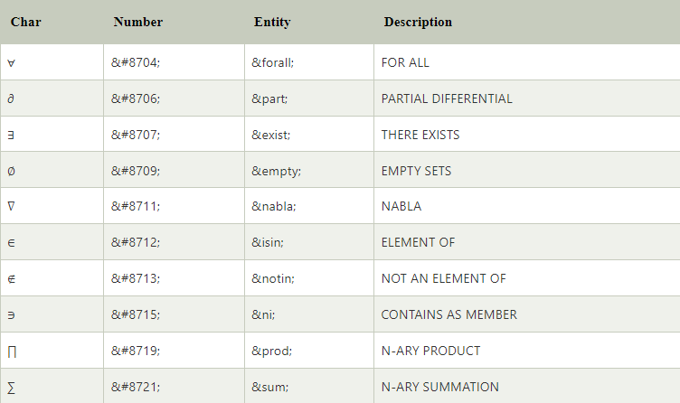

# HTML Notes/Bangla Documentation

 - ##  Html কি? 
    HTML মানে **“Hyper Text Markup Language”**. HTML হল Web Pages তৈরির জন্য আদর্শ Markup Language. HTML একটি Web Page এর গঠন বর্ণনা করে। HTML উপাদানগুলি Browser কে বলে যে কীভাবে Content গুলো প্রদর্শন করতে হবে।

- ##  Html আমরা কেন ব্যবহার করব?
    
    HTML ব্যবহার করার মূল উদ্দেশ্য হচ্ছে আমাদের Web Document গুলোকে Structure ভাবে সাজানো। কারণ HTML হল একমাত্র Web Language যা Browser বুঝতে পারে এবং HTML এর কাজ হল Web Page এর গঠন বর্ণনা করা। এছাড়া আরও কিছু Common use আছে সেগুলো হলঃ- 
    
    - Web Page Structure তৈরি করতে।
    - Web Page Navigation করতে। অর্থাৎ Web এর এক Page থেকে অন্য Page এর সাথে Link করতে।
    - Web Page এ Images এবং Videos Add করতে। ইত্যাদি।
- ##  Html Tag কি? Html Tag কয় ধরণের ও কি কি?
    
    HTML Tag হল একটি Web Page এর Keywords যা ওয়েব Browser কে Web Page টি কীভাবে Format এবং Display করতে হবে তা নির্ধারণ করে। প্রায় সব Tag এ দুটি অংশ থাকে, একটি Open Tag, এবং একটি Close Tag. Some HTML Tag: 
    
    ```html
    <html>  => Opening Tag
    </html> => Closing Tag
    <h1> </h1>  - Heading Tag ব্যবহার করা হয় Web Page এর Heading অংশ নির্দিষ্ট করতে।
    <p> </p>    - Paragraph Tag ব্যবহার করা হয় Web Page এর paragraph অংশ নির্দিষ্ট করতে।
    <b> </b>    - Bold Tag ব্যবহার করা হয় Web Page এর text মোটা করতে।
    <u> </u>    - Underline Tag ব্যবহার করা হয় Web Page এর text underline করতে।
    ```
    
    **`<h1>`** থেকে **`<h6>`** পর্যন্ত ৬টি HTML Heading Tag রয়েছে যেগুলো কোন Website এ ব্যবহার করা হয় Titles অথবা Subtitles প্রধান করতে। Search Engines Heading ব্যবহার করে Web Page এর Content Index করে থাকে।  Example:
    
    ```html
    <h1>Heading 1</h1>
    <h2>Heading 2</h2>
    <h3>Heading 3</h3>
    <h4>Heading 4</h4>
    <h5>Heading 5</h5>
    <h6>Heading 6</h6>
    ```
    
    HTML Tag দুই ধরণের হয়ে থাকে। সেগুলো হল:
    
    - Container Tag,
    - Empty Tag বা Void Tag.
    
    <ins>***Container Tag***</ins> :
    
    যে সকল Tag এর Opening এবং Closing থাকে সে সকল Tag কে Container Tag বলে। যেমন **`<b>content...</b>`**
    
    <ins>***Empty Tag***</ins> বা <ins>***Void Tag***</ins> :
    
    যেসকল Tag এর শুধুমাত্র Opening Tag থাকে সেসকল Tag কে Empty Tag বা Void Tag বলে। যেমন, **`<br/>`** , **`<hr/>`**
    
    ### <ins>*HTML Meta Tags গুলো হল*</ins> :
    
    **`<!DOCTYPE>`**, **`<title>`**, **`<link>`**, **`<meta>`** এবং **`<style>`**
    
    ### <ins>*HTML Text Tags গুলো হল*</ins> :
    
    **`<p>`**, **`<h1>`**, **`<h2>`**, **`<h3>`**, **`<h4>`**, **`<h5>`**, **`<h6>`**,**`<b>`**, **`<strong>`**,**`<i>`**, **`<u>`**, **`<em>`**, **`<abbr>`**, **`<address>`**, **`<bdo>`**, **`<blockquote>`**, **`<cite>`**, **`<q>`**, **`<code>`**, **`<ins>`**, **`<del>`**, **`<pre>`**,**`<small>`**, **`<samp>`**, **`<var>`** ,**`<hr>`** এবং **`<br>`**
    
    ### <ins>*HTML Link Tags গুলো হল*</ins> :
    
    **`<a>`** এবং **`<base>`**
    
    ### <ins>*HTML Image and Object Tags গুলো হল*</i> :
  
    **``**, **`<map>`**,**`<area>`**,**`<picture>`**, **`<source>`**, **`<param>`** এবং **`<object>`**
    
    ### <ins> *HTML List Tags গুলো হল* </i> :
    
    **`<ul>`**, **`<ol>`**, **`<li>`**, **`<dl>`**, **`<dt>`** এবং **`<dd>`**
    
    ### <ins> *HTML Table Tags গুলো হল* </i> :
    
    **`<table>`**, **`<tr>`**, **`<td>`**, **`<th>`**, **`<tbody>`**, **`<thead>`**, **`<tfoot>`**, **`<col>`**, **`<colgroup>`** এবং **`<caption>`**
    
    ### <ins> *HTML Form Tags গুলো হল* </i> :
    
    **`<form>`**, **`<input>`**, **`<textarea>`**, **`<select>`**, **`<option>`**, **`<optgroup>`**, **`<button>`**, **`<label>`**, **`<progress>`**, **`<fieldset>`** এবং **`<legend>`**
    
    ### <ins> *HTML Scripting Tags গুলো হল* </ins> :
    
    **`<script>`** এবং **`<noscript>`**
    
    ---
    
- ## Html  Element কি? Html Element কয় ধরণের ও কি কি?
    
    HTML element বলতে বুঝায়, প্রথমে একটা Starting Tag থাকবে, তারপর কিছু Content থাকবে, এবং শেষে Ending Tag থাকবে। মোট কথা, HTML Element হল Start Tag থেকে Close Tag পর্যন্ত সবকিছু। Ex: 
    
    ```html
    <h1> Hello world </h1>  - এটি একটি HTML Element.
    ```
    
    ***Nested HTML Elements:*** HTML Element Nested হতে পারে। অর্থাৎ একটা Element এর ভিতরে আরেকটা Element ব্যবহার করা যায়।
    
    Default Display এবং styling Purpose এর ভিত্তিতে HTML Element কে দুই categories এ ভাগ করা হয়। সেগুলো হল: 
    
    - Block-level element
    - Inline element
    
    ### *Block-level element*:
    
    Block-level Element হল সেই সব Element যেগুলো Website এর ডান এবং বামের সকল জায়গা নিয়ে গঠিত হয়। Block-level Element সবসময় নতুন Line থেকে শুরু হয়। Block-level Element গুলো নিচে নিচে অবস্থান করে। Example:
    
    ```html
    <!DOCTYPE html>
    <html>
      <head>
      </head>
      <body>
        <div style="background-color: lightblue">This is first div</div>
        <div style="background-color: lightgreen">This is second div</div>
        <p style="background-color: pink">This is a block level element</p>
      </body>
    </html>
    ```
    
    এখানে Block-level Element বুঝানোর জন্য CSS Property **`background-color`** ব্যবহার করা হয়েছে। এটা নিয়ে আমরা CSS Notes এ আলোচনা করব।
    
    HTML এ Block-level Element গুলো হল:
    
        <address>, <article>, <aside>, <blockquote>, <canvas>, <dd>, <div>, <dl>, <dt>, <fieldset>, <figcaption>, <figure>, <footer>, <form>, <h1> - <h6>, <header>, <hr>, <li>, <main>, <nav>, <noscript>, <ol>, <output>, <p>, <pre>, <section>, <table>, <tfoot>, <ul> and <video>.
    
    ### ***Inline elements***:
    
    Inline Element হল সেই সব Element যা ব্যবহার করা হয় Webpage এর কোন অংশকে আলাদাভাবে Style করার জন্য। Inline Element বেশিরভাগ সময় অন্যান্য Elements এর মধ্যে ব্যবহার করা হয়। Inline Element গুলো নতুন Line দিয়ে শুরু হয় না। এটা মূলত Text এর Width অনুসারে জায়গা নেই। Inline Element গুলো পাশাপাশি অবস্থান করে।
    
    Example:
    ```html
    <!DOCTYPE html>
    <html>
      <head>
      </head>
      <body>
         <a href="https://www.javatpoint.com/html-tutorial">Click on link</a>
         <span style="background-color: lightblue">this is inline element</span>
         <p>This will take the width of the text only</p>
      </body>
    </html>
    ```
    
    HTML এ Inline Element গুলো হল:
    
        <a>, <abbr>, <acronym>, <b>, <bdo>, <big>, <br>, <button>, <cite>, <code>, <dfn>, <em>, <i>, , <input>, <kbd>, <label>, <map>, <object>, <q>, <samp>, <script>, <select>, <small>, <span>, <strong>, <sub>, <sup>, <textarea>, <time>, <tt>, <var>.
    
    ---
    
- ## Html Attribute কি? এবং Attribute আমরা কিভাবে লিখব?
    
    HTML-এ, Attributes গুলো Elements এর সম্পর্কে অতিরিক্ত তথ্য প্রদান করে। Attribute ব্যবহার করা হয় HTML Element এর Behavior বা Appearance পরিবর্তন করতে বা Element এর সাথে যুক্ত অতিরিক্ত ডেটা সরবরাহ করতে। Attributes গুলো লিখতে হয় Opening Tag এর মধ্যে। Attribute একটি Name থাকে এবং একটি Value নিয়ে গঠিত হয়, এবং একটি সমান চিহ্ন (=) দ্বারা Value কে পৃথক করা হয় এবং (") চিহ্ন দিয়ে আবদ্ধ করা হয়। Attribute লিখতে হয় **`<Tag_Name Attribute_Name = "Value"> Content </Tag_Name>`**
    
    ```html
    <a href="https://www.example.com">Click here</a>  
    Here **herf** is Attribute Name and **https://www.example.com** is Attribute Value.
    ```
    
    **Some common attributes are:** 
    
    - **`class :`**  এটির মাধ্যমে এক বা একাধিক CSS  ক্লাস ব্যবহার করা যায়। যা আমাদের CSS Style ব্যবহার করতে দেয়।
    - **`id:`** এটির মাধ্যমে আমারা একটা Unique Identifier তৈরি করতে পারি একটা Element এর জন্য। যেটার মাধ্যমে আমরা চাইলে CSS Style ব্যবহার করত পারি, অথবা চাইলে JavaScript এর মাধ্যমে Element এর Content কে Manipulate করতে পারি।
    - **`src:`** এটির মাধ্যমে আমরা HTML Document এর Image, Video Or Audio File এর URL Source নির্দিষ্ট করা হয়৷
    - **`alt:`** এটির মাধ্যমে আমরা HTML Document এ যখন কোন Image Or Video File load হয় না, তখন Alternative Text কে সেই জায়গায় প্রদর্শন করে। অর্থাৎ কোন Image  File বা Video File কোন কারণে যদি load হতে না পারে সেই জায়গায় আমরা একটা Text দিতে পারি Alternative  হিসেবে,  এটার মাধ্যমে।
    - **`style:`** এটার মাধ্যমে আমরা কোন একটা HTML Document এর মধ্যে Inline CSS সরাসরি Apply করতে পারি।
    - **`disabled:`** এটার মাধ্যমে আমরা কোন Button, From Element, Input Field, User Interaction বন্ধ করে রাখতে পারি।
    - **`placeholder:`** এটার মাধ্যমে আমরা কোন একটা Input Field এ কি লিখতে হবে সেটার Short Hint Or Example Text দেখাতে পারি।
    
    এগুলি হল HTML Attributes এর কয়েকটি উদাহরণ। প্রতিটি HTML Element এর নিজস্ব Attributes Set থাকতে পারে, যা Element's এর Functionality এবং Different Purposes এর উপর নির্ভর করে বিভিন্ন Purpose এ ব্যবহার করে।
    
    ### <ins>*The Lang Attribute*</ins> :
    
    Web Page এর Language Declare করার জন্য, আমাদের **`<html>`** Tag এর ভিতরে **`lang`** Attribute ব্যবহার করতে হবে। এটি সার্চ ইঞ্জিন এবং ব্রাউজারকে Language বুঝতে সহায়তা করে। নিম্নলিখিত উদাহরণটি Language হিসাবে English নির্দিষ্ট করে:
    
    ```html
    <!DOCTYPE html>
    <html lang="en">
    <body>
    ...
    </body>
    </html>
    ```
    
    আমরা চাইলে **`lang`** Attribute এর মধ্যে Language Code এর পাশাপাশি Country Codes ও Add করতে পারি। সুতারাং প্রথম দুইটি Characters Define করে Language এবং পরের দুইটি Characters Define করে Country Code হিসেবে। নিম্নলিখিত উদাহরণটি Language হিসাবে English এবং Country হিসাবে United States কে নির্দিষ্ট করে:
    
    ```html
    <!DOCTYPE html>
    <html lang="en-US">
    <body>
    ...
    </body>
    </html>
    ```
    
    > [Visit this link for All HTML Language Code Reference.](https://www.w3schools.com/tags/ref_language_codes.asp)
    > 
    
    > [Visit this link for All HTML ISO Country Codes Reference.](https://www.w3schools.com/tags/ref_country_codes.asp)
    > 
    
    ---
    
- ## Web Browser কি? এবং এটা কিভাবে কাজ করে?
    
    Web Browser হলো একটি Application Software যা Web Pages এর মধ্যে Text, Image, Video, Animation, Form এবং অন্যান্য সমস্ত Data, Server থেকে Load করে Display করে। এটি Web Page গুলোর মধ্যে Navigate করার জন্য একটি Interface প্রদান করে এবং ব্যবহারকারীর Input গ্রহণ করতে সাহায্য করে। যে সকল Browser সচরাচর ব্যবহার করে থাকে সেগুলো হল: Chrome, Firefox, Microsoft Edge, Opera ইত্যাদি।
    
    একটি Web Browser প্রধানত যে কাজগুলো করে থাকে:
    
    1. একটি URL (Web Address) Enter করা হলে সেটি Web Server এ Request পাঠায়।
    2. Server হতে Web Page এর Data ডাউনলোড করে নিয়ে আসে।
    3. HTML, CSS এবং JavaScript Code নিয়ে সেটিকে Render করে Web Page এ Display করে।
    4. অন্যান্য Media Data যেমন Image, Video, Animation ইত্যাদি Load করে Display করে।
    5. User এর Input যেমন Click, Keyboard Event গ্রহণ করে এবং সেগুলির Appropriate Response প্রদান করে।
    6. Web Page গুলোর মধ্যে Navigation Tools প্রদান করে, যেমন Link এ Click করে অন্য Web Page এ যাওয়া, History Management করা, Back Button, Refresh Button ইত্যাদি।
    
    ---
    
- ## আমরা কিভাবে একটা  Html Document তৈরি করতে পারি এবং এর Basic Structure টা কি?
    
    প্রথমে Computer এ একটি জায়গা (*Desktop, C/D/E যেকোন Drive অথবা Drive এর মধ্যে কোন Folder এর ভিতর* ) Select করতে হবে যেখানে একটি New File নিতে হবে। নতুন File এর যেকোন Name দিতে পারি। তবে File এর Extension টা Change করে html দিতে হবে। 
    
     Html File এ Document লেখার একটা Structure আছে। আমাদের প্রতিটি HTML File এই Structure মেনে শুরু করতে হবে। Structure টা নিচে দেওয়া হল।
    
    ```html
    <!DOCTYPE html>
    <html>
      <head>
        <title>Page Title</title>
      </head>
      <body>
        <h1>My First Heading</h1>
        <p>My first paragraph.</p>
      </body>
    </html>
    ```
    
    - এখানে **`<!DOCTYPE html>`** দ্বারা Browser বুঝতে পারে সে কি ধরণের File Load করবে। **`<!DOCTYPE html>`** দ্বারা Browser বুঝতে পারে এই File টি একটি HTML5 Document.
    - HTML Document শুরু হয় **`<html>`** Element এর মাধ্যমে আর শেষ হয় **`</html>`** Tag এর মাধ্যমে। এর মধ্যেই সমস্ত কোড থাকে, এবং এটি HTML page এর Root Element.
    - **`<head>`** Element মধ্যে HTML Page এর Meta Information গুলো দেওয়া হয়।
    - **`<title>`** Element মূলত HTML Page এর Title দিতে ব্যবহার করা হয়। আর এই Title টি Browser এর Title Bar Or Page Tab এ প্রদর্শন করে।
    - **`<body>`** Element এর মাধ্যে থাকে HTML Document এর সম্পূর্ণ Body. এটি একটি Container হিসেবে কাজ করে, যার মধ্যে সকল Visible Contents গুলো থাকে। যেমন headings, paragraphs, images, hyperlinks, tables, lists, etc.
    
    ### ***HTML Page Structure:***
    
    
    
    
   > 💡 <ins>***Note:***</ins> Browser এর মধ্যে শুধু **`<body>`** Element এ যা থাকবে তা প্রদর্শিত হবে। এছাড়া index.html নামে যে File থাকবে সেটাকে By Default Show করবে।
    ---
    
- ## চলুন  জেনে নিই , Html Formatting Element কোনগুলো এবং এগুলো কিভাবে কাজ করে?
    
    HTML **`<b>`** and **`<strong>`** এই দুইটি Element প্রায় সেইম কাজই করে। কোন Text কে একটু মোটা করে লেখার কাজে ব্যবহার করা হয়।
    
    ```html
    <!DOCTYPE>
    <html>  
      <body>  
           <b> Bold text </b> <br>  
           <strong> Important text </strong> 
      </body>  
    </html>
    
    ```
    
    HTML **`<i>`** and **`<em>`** এই দুইটি Element প্রায় সেইম কাজই করে। কোন Text কে একটু বাঁকা করে লেখার কাজে ব্যবহার করা হয়।
    
    ```html
    
    <!DOCTYPE>
    <html>  
      <body>  
         <i> Italic text </i> <br>
         <em> Emphasized text</em>  
      </body>  
    </html>
    ```
    
    HTML **`<small>`** Element  টি কোন লেখাকে ছোট করে দেখাতে ব্যবহার করা হয়।
    
    ```html
    <!DOCTYPE>
    <html>  
      <body>  
         <p> This is Normal Text </p>
         <small> This is some smaller text </small>   
      </body>  
    </html>
    ```
    
    HTML **`<mark>`** Element টি কোন লেখাকে Highlight করতে ব্যবহার করা হয়।
    
    ```html
    <!DOCTYPE>
    <html>  
      <body>  
          <p> Do not forget to buy <mark> milk </mark> today.</p>
      </body>  
    </html>
    ```
    
    HTML **`<del>`** Element টি কোন লেখাকে Document থেকে Delete করা হয়েছে এরকম বোঝাতে ব্যবহার করা হয়। এইক্ষত্রে Browser সাধারণত Text  এর মাঝখানে একটা লাইন এঁকে দেয়। 
    
    ```html
    <!DOCTYPE>
    <html>  
      <body>  
          <p>My favorite color is <del>blue</del> red.</p>
      </body>  
    </html>
    ```
    
    HTML **`<u>`** Element এর মাধ্যমে আমরা Web Page এর Text এর নিচে Underline দিতে পারি। Example
    
    ```html
    <!DOCTYPE>
    <html>  
      <body>  
           <p> Write Your First <u>Paragraph</u> in underlined text.</p>   
      </body>  
    </html>
    ```
    
    HTML **`<ins>`** Element এর মাধ্যমে HTML Document এ কোন Text Inserted হয়েছে তা নির্দিষ্ট করার জন্য এটা ব্যবহার করা হয়। Browser Inserted Text এর নিচে Underline দিয়ে দেয়। Example:
    
    ```html
    <!DOCTYPE html>
    <html>
      <body>
         <p>My favorite color is <del>blue</del> <ins>red</ins>.</p>
      </body>
    </html>
    ```
    
    HTML **`<sub>`** Element টি মূলত কোন Text কে Subscript করে লিখতে ব্যবহার করা হয়। এটি মূলত Normal Line এর Text এর হাফ নিচে দেখায়। এটি মূলত ব্যবহার করা হয় Chemical Formula তে।
    
    ```html
    <!DOCTYPE>
    <html>  
      <body>  
          <p>This is <sub>subscripted</sub> text.</p>
          <p>Water Symbol is H<sub>2</sub>O</p>
      </body>  
    </html>
    ```
    
    HTML **`<sup>`** Element টি মূলত কোন Text কে Superscript করে লিখতে ব্যবহার করা হয়। এটি মূলত Normal Line এর Text এর হাফ উপরে দেখায়। এটি মূলত ব্যবহার করা হয় Footnotes, Mathematical Formula তে।
    
    ```html
    <!DOCTYPE>
    <html>  
      <body>  
          <p>This is <sup>superscripted</sup> text.</p>
          <p> (a+b)<sup>2</sup> = a<sup>2</sup> + 2ab + b<sup>2</sup> </p>
      </body>  
    </html>
    ```
    
    HTML **`<pre>`** Element ব্যবহার করে আমরা কোন কবিতাকে সুন্দরভাবে Display করতে পারি। Example:
    
    ```html
      <!DOCTYPE html>
      <html>
        <body>
            <p>The pre tag preserves both spaces and line breaks:</p>
            <pre>
              My Bonnie lies over the ocean.
            
              My Bonnie lies over the sea.
            
              My Bonnie lies over the ocean.
              
              Oh, bring back my Bonnie to me.
            </pre>
        </body>
      </html>
    ```
    
    HTML **`<br>`** Tag Use  করা হয় Line Break করার জন্য। Current Text Line থেকে Next Line এ যেতে হলে এটি ব্যবহার করা হয়। Example
    
    ```html
    <!DOCTYPE html>
    <html>
      <head>
      </head>
      <body>
        <p>This is First Line. This is second Line </p>  <!--Without br Tag -->
        
        <p>This is First Line. <br> This is second Line </p> <!--With br Tag -->
      </body>
    </html>
    ```
    
    HTML **`<hr>`** Tag Use করা হয় Website এ Horizontal Line Display করতে। Example:
    
    ```html
    <!DOCTYPE html>
    <html>
      <head>
      </head>
      <body>
        <h1>This is Hedding </h1> 
        <hr>
        <p>Lorem Ipsum is simply dummy text of the printing and typesetting industry. Lorem Ipsum has been the industry's standard dummy text ever since the 1500s, when an unknown printer took a galley of type and scrambled it to make a type specimen book.</p>
      </body>
    </html>
    ```
    
    HTML **`<kbd>`** Tag ব্যবহার করা হয় Keyboard এর Input Define করতে। অর্থাৎ আমরা যদি Website এ কোন keyboard Shortcut লিখতে চাই সেক্ষেত্রে এটা ব্যবহার করব। Example:
    
    ```html
    <!DOCTYPE html>
    <html>
    	<body>
    		<h1>The kbd element</h1>
    		<p>Press <kbd>Ctrl</kbd> + <kbd>C</kbd> to copy text (Windows).</p>
    	</body>
    </html>
    ```
    
    HTML **`<code>`** Tag ব্যবহার করা হয় Computer Code অংশকে Define করতে। অর্থাৎ আমরা যদি Website এ কোন Programming Code লিখতে চাই সেইক্ষেত্রে এটা ব্যবহার করব। Example:
    
    ```html
    <!DOCTYPE html>
    <html>
    <body>
      <h2>The code Element</h2>
      <p>Programming code example:</p>
      <code>
        x = 5;
        y = 6;
        z = x + y;
      </code>

      <h2>The code Element with pre tag</h2>
      <pre>
        <code>
          x = 5;
          y = 6;
          z = x + y;
        </code>
      </pre>
    </body>
    </html>
    ```
    
    
   > 💡 <ins>***Note:***</ins>  **`<code>`** Tag অতিরিক্ত Space এবং Line Break সংরক্ষণ করে না। তাই আমরা যেভাবে লিখব ওইভাবে ফলাফল পেতে চাইলে **`<pre>`** Tag ব্যবহার করতে পারি।
  
    
    HTML **`<samp>`** Tag ব্যবহার করা হয় Computer Code এর Output অংশকে Define করতে। 
    
    ```html
    <!DOCTYPE html>
    <html>
    	<body>
    		<h2>The samp Element</h2>
    		<p>Message from my computer:</p>
    		<p><samp>File not found.<br>Press F1 to continue</samp></p>
    	</body>
    </html>
    ```
    
    HTML **`<var>`** Tag ব্যবহার করা হয় Computer Programming অথবা Mathematical Expression এর মধ্যে Variable Define করতে। 
    
    ```html
    <!DOCTYPE html>
    <html>
    	<body>
    		<h2>The var Element</h2>
    		<p>The area of a triangle is: 1/2 x <var>b</var> x <var>h</var>, where <var>b</var> is the base, and <var>h</var> is the vertical height.</p>
    	</body>
    </html>
    ```
    
    ---
    
- ## চলুন  জেনে নিই , Html Quotations Element কোনগুলো  এবং এগুলো কিভাবে কাজ করে?
    
    HTML **`<blockquote>`** Element এর মাধ্যমে আমরা আমাদের Web Site এ, Another Web Site থেকে কোন  Text ব্যবহার করলে সেটার Source নির্দিষ্ট করে দিতে ব্যবহার করা হয়। **`cite`** Attribute এর মাধ্যমে আমরা Source টি দিয়ে দিতে পারি। Example:
    
    ```html
    <!DOCTYPE html>
    <html>
    	<body>
    			<p>Here is a quote from WWF's website:</p>
    			<blockquote cite="http://www.worldwildlife.org/who/index.html">
    			      For 60 years, WWF has worked to help people and nature thrive. As the world's leading conservation organization, WWF works in nearly 100 countries. At every level, we collaborate with people around the world to develop and deliver innovative solutions that protect communities, wildlife, and the places in which they live.
    			</blockquote>
    	</body>
    </html>
    ```
    
    HTML **`<q>`** Element এর মাধ্যমে আমরা HTML Element Text এর মধ্যে Quotation Mark ব্যবহার করতে পারি। Example: 
    
    ```html
    <!DOCTYPE html>
    <html>
      <body>
    	   <p>Browsers usually insert quotation marks around the q element.</p>
    	   <p>WWF's goal is to: <q>Build a future where people live in harmony with nature.</q></p>
     </body>
    </html>
    ```
    
    HTML **`<abbr>`** Element দ্বারা আমরা Abbreviation Word(like HTML, CSS, Dr. ইত্যাদি) এর সম্পূর্ণ Text কে Title আকারে দেখাতে পারি। এখানে **`title`** Attribute এর মাধ্যমে আমরা সম্পূর্ণ Text টি দিতে পারি। Example:
    
    ```html
    <!DOCTYPE html>
    <html>
    	<body>
    			<p>The <abbr title="World Health Organization">WHO</abbr> was founded in 1948.</p>
    			<p>Marking up abbreviations can give useful information to browsers, translation systems and search-engines.</p>
    	</body>
    </html>
    ```
    
    HTML **`<address>`** Element এর মাধ্যমে আমরা কোন Document অথবা Article Owner এর Contact Information দিতে পারি। Contact Information হতে পারে Email Address, URL, Physical Address, Phone Number, Social Media ইত্যাদি। Example:
    
    ```html
    <!DOCTYPE html>
    <html>
    	<body>
    			<p>The HTML address element defines contact information (author/owner) of a document or article.</p>
    			<address>
    				Written by John Doe.<br> 
    				Visit us at:<br>
    				Example.com<br>
    				Box 564, Disneyland<br>
    				USA
    			</address>
    	</body>
    </html>
    ```
    
    HTML **`<cite>`** Element এর মাধ্যমে আমরা একটি Creative Work(a book, a painting, a song ইত্যাদি) এর Title নির্দিষ্ট করতে পারি। Browser মূলত cite Element text কে Italic করে দেয়। Example:  
    
    ```html
    <!DOCTYPE html>
    <html>
    	<body>
    			<p>The HTML cite element defines the title of a work.</p>
    			<p>Browsers usually display cite elements in italic.</p>
    			
    			<p><cite>The Scream</cite> by Edvard Munch. Painted in 1893.</p>
    	</body>
    </html>
    ```
    
    > 💡 <ins>***Note:***</ins> একজন ব্যক্তির নাম একটি কাজের শিরোনাম হবে না।
    
    ---
    
- ## চলুন  জেনে নিই , Html Comment কি? এটা কেন ব্যবহার করা হয়?
    
    Comment ব্যবহার করা হয় Source Code এ. Comment এর মাধ্যমে Source Code এর কোন Element কি জন্য লেখা হচ্ছে সেটা বলে দেওয়া যায়। আর HTML Comment Browser এ প্রদর্শিত হয় না। Comment করে রাখলে পরবর্তিতে Document বুঝতে সুবিধা হয়। আমরা যেভাবে Html Comment করতে পারি তা হল:
    
    ```html
    <!-- Write your comments here -->  এইটা একটা Html Comment Block. এই Block এর মাঝখানে আমরা আমাদের Comment টা লিখব। আমরা চাইলে এইটার মাঝখানে যে কোন Code Hide করে রাখতে পারি Browser থেকে। এছাড়া আমরা চাইলে ২,৩ বা তার অধিক Line Comment ও এর মাঝে রাখতে পারি।
    
    <p>This is a paragraph.</p>
    <!--
    <p>Look at this cool image:</p>
    
    -->
    <p>This is a paragraph too.</p>
    ```
    
    ---
    
- ## চলুন  জেনে নিই , Html Link বলতে কি বুঝায় এবং এটা কিভাবে কাজ করে?
    
    HTML Document এ কোন Web Page কে অন্যকোন Web Page এর সাথে বা অন্যকোন Website এর Web Page এর সাথে Link করতে HTML Link ব্যবহার করা হয়। HTML Link মূলত Hyperlinks হিসেবে কাজ করে। Hyperlinks এর কাজ হচ্ছে Link এ Click করলে Jump করে Current Web Page থেকে Another Web Page এ চলে যাওয়া। কোন Document এ কোন Element Hyperlink কিনা সেটা দেখতে হলে ওই element এর উপর Mouse Cursor নিয়ে গেলে Cursor টি যদি Little Hand`(👆🏿)` এ change হয়ে যায় তাহলে এটা একটা Hyperlink. Example:
    
    ```html
    <a href="url">link text</a>  
    <a> এই Tag কে মূলত Anchor Tag বলা হয়। এইটার মাধ্যমে একটা Element কে Link করা যায়। 
    এইখানে **href** Attribute এর মাধ্যমে Link এর Destination বলে দেওয়া যায়। Example:
    <a href="https://www.example.com/">Visit example.com</a>
    ```
    
    HTML Link শুধু Text কে করা হয় না, আমরা চাইলে যেকোন Element কে Hyperlink করতে পারি। নিচে একটা Image File কে Hyperlink করার Example দেওয়া হল।
    
    ```html
    <a href="https://www.example.com">
       
    </a>
    ```
    
    HTML Link এ আমরা চাইলে আরেকটা বিষয় বলে দিতে পারি। সেটা হল Link, Browser এর কোন Tab এ Open হবে। আমরা বর্তমানে Browser এর যেই Tab এ আছি সেটাতে নাকি, নতুন কোন Tab এ Open হবে। এই কাজটা আমরা করতে পারি **`target`** Attribute এর মাধ্যমে। 
    
    Most Useful **`target`** Attribute Value are:
    
    - **`_self`**  → এটা By Default থাকে। এইটা আমাদের Document কে আমরা Browser এর যেই Tab এ আছি ওই Tab এই Open করবে।
    - **`_blank`** → এটা Document টাকে Browser এর নতুন একটা Tab Open করে, নতুন Tab এ Open করবে।
    
    ```html
    <a href="https://www.example.com/" target="_blank">Visit here!</a>
    ```
    
    **Absolute URLs vs. Relative URLs**
    
    - Absolute URL(A Full Web Address)
    - Relatives URL(https://www Part ছাড়া Same Website এর অন্য Page)
    
    ```html
    <h2>Absolute URLs</h2>
    <p><a href="https://www.facebook.com/">Facebook</a></p>
    <p><a href="https://www.google.com/">Google</a></p>
    
    <h2>Relative URLs</h2>
    <p><a href="home.asp">Home Page</a></p>
    <p><a href="./css/default.asp">CSS Tutorial</a></p>
    ```
    
    আমরা চাইলে **`href`** Attribute এর মাধ্যে **`mailto:`** এর মাধ্যমে User এর Email Program খোলার একটা Link তৈরি করে দিতে পারি। Example: 
    
    ```html
    <a href="mailto:someone@example.com">Send email</a>
    ```
    
    আমরা চাইলে **`title`** Attribute এর মাধ্যমে Element সম্পর্কে কিছু Specific Extra Information দিতে পারি। এই Information আমরা যখন Mouse Element এর উপর Hover করব তখন Tooltip Text আকারে Show করবে। Example: 
    
    ```html
    <a href="https://www.example.com" title="Go to example cite"> Visit </a>
    ```
    
    আমরা চাইলে **`download`** Attribute এর মাধ্যমে একটি Link কে Downloadable করতে পারি। অর্থাৎ আমরা এটার মাধ্যমে User কে Website থেকে কোন Document Download করতে দিতে পারি। Example:
    
    ```html
    <a href="./flower.png" download >Download Here</a>
    ```
    
    ### <ins>***Create a Bookmark in HTML***</ins>
    
    Bookmark করা দরকারি হয়ে পড়ে তখন, যখন একটা Web Page অনেক লম্বা হয়ে থাকে। Bookmark তৈরি করতে - প্রথমে Bookmark টি তৈরি করতে হবে তারপর Link যুক্ত করতে হবে। যখন User Link এ Click করবে তখন Web Page টি Jump করে Bookmark অনুযায়ী নিচে বা উপরে Scroll করবে। Bookmark করার জন্য আমরা Always HTML Element এ **`id`** Attribute ব্যবহার করব। Example:
    
    ```html
    <!DOCTYPE html>
    <html>
    	<body>
    			<p><a href="#C4">Jump to Chapter 4</a></p>
    			<p><a href="#C10">Jump to Chapter 10</a></p>
    			<p><a href="#C17">Jump to Chapter 17</a></p>
    			
    			<h2>Chapter 1</h2>
    			<p>This chapter explains ba bla bla</p>
    			
    			<h2>Chapter 2</h2>
    			<p>This chapter explains ba bla bla</p>
    			
    			<h2>Chapter 3</h2>
    			<p>This chapter explains ba bla bla</p>
    			
    			<h2 id="C4">Chapter 4</h2>
    			<p>This chapter explains ba bla bla</p>
    			
    			<h2>Chapter 5</h2>
    			<p>This chapter explains ba bla bla</p>
    			
    			<h2>Chapter 6</h2>
    			<p>This chapter explains ba bla bla</p>
    			
    			<h2>Chapter 7</h2>
    			<p>This chapter explains ba bla bla</p>
    			
    			<h2>Chapter 8</h2>
    			<p>This chapter explains ba bla bla</p>
    			
    			<h2>Chapter 9</h2>
    			<p>This chapter explains ba bla bla</p>
    			
    			<h2 id="C10">Chapter 10</h2>
    			<p>This chapter explains ba bla bla</p>
    			
    			<h2>Chapter 11</h2>
    			<p>This chapter explains ba bla bla</p>
    			
    			<h2>Chapter 12</h2>
    			<p>This chapter explains ba bla bla</p>
    			
    			<h2>Chapter 13</h2>
    			<p>This chapter explains ba bla bla</p>
    			
    			<h2>Chapter 14</h2>
    			<p>This chapter explains ba bla bla</p>
    			
    			<h2>Chapter 15</h2>
    			<p>This chapter explains ba bla bla</p>
    			
    			<h2>Chapter 16</h2>
    			<p>This chapter explains ba bla bla</p>
    			
    			<h2 id="C17">Chapter 17</h2>
    			<p>This chapter explains ba bla bla</p>
    			
    			<h2>Chapter 18</h2>
    			<p>This chapter explains ba bla bla</p>
    			
    			<h2>Chapter 19</h2>
    			<p>This chapter explains ba bla bla</p>
    			
    			<h2>Chapter 20</h2>
    			<p>This chapter explains ba bla bla</p>
    			
    			<h2>Chapter 21</h2>
    			<p>This chapter explains ba bla bla</p>
    			
    			<h2>Chapter 22</h2>
    			<p>This chapter explains ba bla bla</p>
    			
    			<h2>Chapter 23</h2>
    			<p>This chapter explains ba bla bla</p>
    	</body>
    </html>
    ```
    
    ---
    
- ## চলুন  জেনে নিই , Html Image, Picture Element গুলো কি কাজ করে এবং কিভাবে কাজ করে?
    
    HTML Web Page এ আমরা **``** Tag Use করে Image Display করতে পারি। Image যুক্ত করার মাধ্যমে আমরা Web Page এর Design Improve করতে পারি। শুধু **``** Tag এর মাধ্যমে কিন্তু আমরা Image যুক্ত করতে পারব না। Image যুক্ত করার জন্য **``** Tag এর ভিতরে **`src`** Attribute ব্যবহার করতে হবে। **``** Tag একটি Empty Tag. HTML Document এ Image যুক্ত করার Syntax:
    
    ```html
    
    ```
    
    এইখানে আমরা **`src`** Attribute এর মধ্যে আমরা যে Image টাকে যুক্ত করব তার Path টা দেখিয়ে দিতে হবে। আর **`alt`** Attribute এর মধ্যে  একটি Alternative Text দিতে হবে, যাতে কোন কারণে যদি আমাদের দেখানো Path এ Image না থাকে, থাহলে এই Text টি দেখাবে। প্রতিটি **``** Tag এ অব্যশই **`alt`** Attribute ব্যবহার করা জরুরি Best Practices হিসেবে।   Example:
    
    ```html
    
    ```
    
    এছাড়া **`height`**, **`width`** Attribute  অথবা **`style`** Attribute এর মাধ্যমে আমরা চাইলে Image এর দৈর্ঘ্য ও প্রস্থ নির্দিষ্ট করে দিতে পারি। Example: 
    
    ```html
    <!-- with height and width Attribute -->
    
    <!-- with style Attribute -->
    
    ```
    
    এছাড়া কোন Folder থেকে Image যুক্ত করতে চাইলে Path এর মধ্যে Image এর নামের আগে ” `/` ” দিয়ে Folder এর নামটা দিয়ে দিতে হবে **`src`** Attribute এর মধ্যে। মনে করি আমাদের ছবিটা images নামক একটা Folder এ আছে। তাহলে আমরা Image টা যেভাবে যুক্ত করব তা হলঃ
    
    ```html
    
    ```
    
    অনেক ক্ষেত্রে Image Server বা অন্য কোন Website থেকে Load করতে হবে। সেক্ষেত্রে ওই Website এর Image URL টা **`src`** Attribute এ দিতে হবে। Example:
    
    ```html
    
    ```
    
    **`(Advance Topic)`** এছাড়া আমরা যখন প্রাথমিক অবস্থায় কোন Website Browser এ Load করায় তখন এটা সম্পূর্ণ Load হয়ে থাকে A to Z। অর্থাৎ Text, Images, Videos যা থাকে Webpage এ সব একসাথে Load হয়ে যায়। এতে করে Network এবং Bandwidth বেশি খরচ হয়ে থাকে। আমরা চাইলে **`loading`** Attribute এর **`lazy`** Value এর মাধ্যমে প্রাথমিক অবস্থায় Website এ Image Load হওয়াটা Control করতে পারি। এতে করে আমাদের Network এবং Bandwidth খরচ কিছুটা কমে আসবে। **`loading`** Attribute এর **`lazy`** Value ব্যবহার করলে যেই কাজটা হবে মূলত সেটা হল, Viewport**(**একটা Device এ স্বাভাবিক অবস্থায় যতটুকু দেখা যায়**)** থেকে নির্দিষ্ট দূরত্বে না পৌঁছানো পর্যন্ত Image Load করা স্থগিত করে। যখনি আমরা Scroll করে Image এর কাছাকাছি যাব তখনি Image টা Load হবে এর আগে কিন্তু হবে না। Example:
    
    ```html
    
    ```
    
   
   > 💡 <ins>***Note***</ins>: এটা আমরা Image এবং Iframes Tag এর ক্ষেত্রে ব্যবহার করতে পারব।
    
    ### <ins>***Common Image Formats***</ins>
    
    সব Browser(Chrome, Edge, Firefox, Safari, Opera) এ Support করে এইরকম Image File Types গুলো নিচে দেওয়া হল:
    
    | Abbreviation | File Format | File Extension |
    | --- | --- | --- |
    | APNG | Animated Portable Network Graphics | .apng |
    | GIF | Graphics Interchange Format | .gif |
    | ICO | Microsoft Icon | .ico, .cur |
    | JPEG | Joint Photographic Expert Group image | .jpg, .jpeg, .jfif, .pjpeg, .pjp |
    | PNG | Portable Network Graphics | .png |
    | SVG | Scalable Vector Graphics | .svg |
    
    ### <ins>*HTML Picture Element:*</ins>
    
    HTML **`<picture>`** Element Web Developer কে Image Resource নির্দিষ্ট করতে Flexibility দিয়ে থাকে। **`<picture>`** Element টি এক বা একাধিক **`<source>`** Elements ধারণ করতে পারে এবং **`<source>`** Element এর মধ্যে **`srcset`** Attribute এর মাধ্যমে আমরা Images গুলোর Path/URL দিয়ে দিতে পারি এবং **`media`** Attribute এর মাধ্যমে আমরা Device এর Width Select করে দিতে পারি যাতে করে Device এর Width অনুসারে Image গুলো Browser Choose করে Display করতে পারে। Example:
    
    ```html
    <!DOCTYPE html>
    <html>
    	<head>
    			<meta name="viewport" content="width=device-width, initial-scale=1.0">
    	</head>
    	<body>
          <h2>The picture Element</h2>
    			<picture>
    			  <source media="(min-width: 650px)" srcset="https://images.pexels.com/photos/376464/pexels-photo-376464.jpeg?auto=compress&cs=tinysrgb&w=600">
    			  <source media="(min-width: 465px)" srcset="https://images.pexels.com/photos/1805053/pexels-photo-1805053.jpeg?auto=compress&cs=tinysrgb&w=600">
    			  
    			</picture>
    			<p>Resize the browser to see different versions of the picture loading at different viewport sizes.
    			The browser looks for the first source element where the media query matches the user's current viewport width,
    			and fetches the image specified in the srcset attribute.</p>
    
    			<p>The img element is required as the last child tag of the picture declaration block.
    			The img element is used to provide backward compatibility for browsers that do not support the picture element, or if none of the source tags matched.
    			</p>
    			
    			<p><strong>Note:</strong> The picture element is not supported in IE12 and earlier or Safari 9.0 and earlier.</p>
      </body>
    </html>
    ```
    
    
    > 💡 <ins>***Note***</ins> : সবসময় **`<picture>`** Element এর Last Child হিসেবে একটি **``** Element দিতে হবে। কোন Browser যদি **`<picture>`** Element Support না করে অথবা **`<source>`** Element Match না করলে **``** Element টি Display হবে। **``** Element সকল Browser Support করে থাকে।
  
    
    কখন আমরা মূলত **`<picture>`** Element ব্যবহার করব:
    
    দুইটা Main Purposes এ **`<picture>`** Element ব্যবহার করা হয়। তা হল:
    
    1. <ins>**Bandwidth**</ins>  ⇒ আমরা যদি আমাদের Website একটি ছোট Screen Or Device এর মধ্যে Run করি তাহলে কিন্তু আমাদের একটি বড় Image File Load করার প্রয়োজন নাই। Browser Device এর Width অনুসারে **`<source>`** Element থেকে Image File টি load করব এবং বাকি Elements গুলো Ignore করবে। এতে করে আমাদের Bandwidth অনেক সাশ্রয় হবে।
    2. <ins>**Format Support**</ins> ⇒  কিছু Browser বা Device সব Image Format Support নাও করতে পারে। আমরা **`<picture>`** Element এর মাধ্যমে সব Image Format Add করে দিব। Browser প্রথমে যে Format টি Support করবে সেটি ব্যবহার করবে আর বাকি গুলো Ignore করে দিবে।
    
    Example:
    
    ```html
    <!DOCTYPE html>
    <html>
    	<head>
    			<meta name="viewport" content="width=device-width, initial-scale=1.0">
    	</head>
    	<body>
    			<h2>The picture Element</h2>
    			<picture>
    			  <source srcset="https://images.pexels.com/photos/5255232/pexels-photo-5255232.jpeg?auto=compress&cs=tinysrgb&w=600">
    			  <source srcset="https://images.pexels.com/photos/6833459/pexels-photo-6833459.jpeg?auto=compress&cs=tinysrgb&w=600">
    			  
    			</picture>
    			<p>The picture element can be used when the image format is not supported by all devices.</p>
    			<p>The device will use the first image format it supports, and ignore the rest of the images.</p>
    	</body>
    </html>
    ```
    
 
  >  💡 <ins>***Note***</ins>: Browser Attribute এর Value সাথে মিলে যাওয়া প্রথম **`<source>`** Element টি ব্যবহার করবে, এবং বাকি Element গুলোকে Ignore করবে।

    
    ### <ins>***HTML Figure and Figcaption  Element***</ins>
    
    Html **`<figure>`** Tag এর মাধ্যমে আমরা কোন Image কে Mark করতে পারি এবং এর ভিতরে **`<figcaption>`** Tag এর মাধ্যমে আমরা  ঐ Image টার একটা Caption দিতে পারি। Example:
    
    ```html
    <!DOCTYPE html>
    <html>
    	<body>
    		<h1>The figure and figcaption element</h1>
    		<figure>
    		  
    		  <figcaption>Fig.1 - Flower image.</figcaption>
    		</figure>
    	</body>
    </html>
    ```
    
    ***[Learn HTML \<map> and \<area> Elements Here.](https://www.w3schools.com/html/html_images_imagemap.asp)***
    
    ---
    
- ## চলুন  জেনে নিই , Html Video Element কি কাজ করে এবং কিভাবে কাজ করে?
    
    HTML Document এ আমরা **`<video>`** Tag এর মাধ্যমে Video Add করতে পারি। HTML5 এ Video Tag Support করে। Example: 
    
    ```html
    <video width="500" height="300" controls>
       <source src="./Gordon Goose_ Weekend! _ Funny animated short film.mp4" type="video/mp4">
       <source src="./Gordon Goose_ Weekend! _ Funny animated short film.webm" type="video/webM">
        Your browser does not support the video tag.
    </video>
    ```
    
    Image Tag এর মত Video Tag, Video Display করতে Help করে। কিন্তু Video যুক্ত করার জন্য আমাদের **`src`** Attribute এর মাধ্যমে Video এর Path টি দেখিয়ে দিতে হবে। 
    
    - এবং আমরা চাইলে **`height`** and **`width`** Attribute এর মাধ্যমে Video এর Height এবং Width Select করে দিতে পারি।
    - আমরা **`controls`** Attribute এর মাধ্যমে চাইলে Video Control করতে পারি। যেমন Video Play, Push এবং Volume Control করতে পারব।
    - আমরা **`<source>`** Element এর মাধ্যমে  Alternative Video File গুলো দিয়ে দিতে পারি, যেখান থেকে যেই Browser যেই File Format Support করবে সেই Browser সেই File টা  Choose করে Load করতে পারবে। এবং কোনটা Support না করলে শেষে দেওয়া Text টি দেখাবে। বর্তমানে HTML Video Tag তিন ধরনের Video Formats Support করে। There are: $mp4, webm, ogg.$
    
    নিচে কোন Browser কি কি File Formats Support করে তার একটি তালিকা দেওয়া হল:
   
    | Browser Name | mp4 | webM |ogg |
    | --- | --- | --- | --- |
    | Internet Explorer | Yes | No | No |
    | Google Chrome | Yes | Yes | Yes |
    | Mozilla Firefox|Yes|Yes|Yes|
    | Opera|Yes|Yes|Yes|
    | Safari|Yes|No|No|

    > 💡 <ins>**Note**</ins>: Android শুধু mp4 file support করে।

    আমরা **`autoplay`** Attribute এর মাধ্যমে চাইলে Video Automatically Start করতে পারি, যখন Browser Load হবে তখন, এবং **`loop`** Attribute এর মাধ্যমে Video টি চাইলে বার বার চালাতে পারি। এছাড়া **`muted`** Attribute এর মাধ্যমে Video Sound Mute করে রাখতে পারি। Example:
    
    ```html
    <video width="500" height="300" controls autoplay muted loop>
       <source src="./Gordon Goose_ Weekend! _ Funny animated short film.mp4" type="video/mp4">
       <source src="./Gordon Goose_ Weekend! _ Funny animated short film.webm" type="video/webM">
        Your browser does not support the video tag.
    </video>
    ```
    
    আমরা চাইলে **`poster`** Attribute ব্যবহার করে Video এর উপর Thumbnail যুক্ত করতে পারি। 
    
    ```html
    <video width="500" height="300" controls poster="./Gooldren_Duck_Poster.jpg">
       <source src="./Gordon Goose_ Weekend! _ Funny animated short film.mp4" type="video/mp4">
       <source src="./Gordon Goose_ Weekend! _ Funny animated short film.webm" type="video/webM">
        Your browser does not support the video tag.
    </video>
    ```
    
    ---
    
- ## চলুন  জেনে নিই , Html Audio Element কি কাজ করে এবং কিভাবে কাজ করে?
    
    HTML Document এ আমরা **`<audio>`** Tag এর মাধ্যমে Audio Add করতে পারি। HTML5 Audio Tag Support করে। Example:
    
    ```html
    <audio controls>
      <source src="./small-river-in-the-forest-very-close-sound-effect.mp3" type="audio/mp3">
      <source src="./small-river-in-the-forest-very-close-sound-effect.wav" type="audio/wav">
       Your browser does not support the audio element.
    </audio>
    ```
    
    HTML **`<video>`** Tag এর মত **`<audio>`** Tag এর মাধ্যমে আমরা Web Page এ Audio File Add করতে পারি। এখানেও **`controls`** Attribute এর মাধ্যমে আমরা Audio Control করা যাবে। যেমন Audio Play, Push এবং Volume Control করতে পারব। 
    
    এছাড়া, আমরা **`<source>`** Element এর মাধ্যমে  Alternative Audio File গুলো দিয়ে দিতে পারি, যেখান থেকে Browser যেই File Format Support করে সেটা Choose করে Load করতে পারবে, এবং কোনটা Support না করলে শেষে দেওয়া Text টি দেখাবে। বর্তমানে HTML **`<audio>`** Tag তিন ধরণের Audio Formats Support করে। There are: $mp3, wev, ogg.$
    
    নিচে কোন Browser কি কি File Formats Support করে তার একটি তালিকা দেওয়া হল:
    
  | Browser Name|mp3|wav|ogg|
  | --- | --- | --- | --- |
  | Internet Explorer|Yes|No|No|
  | Google Chrome|Yes|Yes|Yes|
  | Mozilla Firefox|Yes|Yes|Yes|
  | Opera|No|Yes|Yes |
  | Safari|Yes|Yes|No |
    
    আমরা **`autoplay`** Attribute এর মাধ্যমে চাইলে Audio Automatically Start করতে পারি। এবং **`loop`** Attribute এর মাধ্যমে Audio টি বার বার চালাতে পারি। এছাড়া **`muted`** Attribute এর মাধ্যমে Audio Sound Mute করে রাখতে পারি। Example:
    
    ```html
    <audio controls autoplay muted loop>
      <source src="./small-river-in-the-forest-very-close-sound-effect.mp3" type="audio/mp3">
      <source src="./small-river-in-the-forest-very-close-sound-effect.wav" type="audio/wav">
       Your browser does not support the audio element.
    </audio>
    ```
    
    ---
    
- ## চলুন  জেনে নিই , Html List Element কি কাজ করে এবং কিভাবে কাজ করে?
    
    HTML List ব্যবহার করা হয় কোন Information List করার ক্ষেত্রে। একটা List এর মধ্যে এক বা একাধিক  List Element থাকবে।  
    
    Html এ তিন ধরণের List রয়েছে। সেগুলো হল :
    
    - Ordered List or Numbered List (ol)
    - Unordered List or Bulleted List (ul)
    - Description List or Definition List (dl)
    
    ### <ins>Ordered HTML List</ins> :
    
    HTML **`<ol>`** Tag এর মাধ্যমে Browser বুঝতে পারে এটা একটা Ordered List. একটা Ordered List Numerical or Alphabetical হয়ে থাকে। Ordered List Start হয় **`<ol>`** Tag এর মাধ্যমে আর প্রতিটি List তৈরি হয় **`<li>`** Tag এর মাধ্যমে। Example:
    
    ```html
    <ol>
      <li> Apple </li>
      <li> Mango </li>
      <li> Banana </li>
    </ol>
    ```
    
    HTML Ordered List By Default Numeric Value দেখায়। আমরা চাইলে **`type`** Attribute এর মাধ্যমে Value টা Select করে দিতে পারি।
    
    ```html
    Numbers:
    <ol type="1">
      <li>Coffee</li>
      <li>Tea</li>
      <li>Milk</li>
    </ol>
    
    Uppercase Letters:
    <ol type="A">
      <li>Coffee</li>
      <li>Tea</li>
      <li>Milk</li>
    </ol>
    
    Lowercase Letters:
    <ol type="a">
      <li>Coffee</li>
      <li>Tea</li>
      <li>Milk</li>
    </ol>
    
    Uppercase Roman Numbers:
    <ol type="I">
      <li>Coffee</li>
      <li>Tea</li>
      <li>Milk</li>
    </ol>
    
    Lowercase Roman Numbers:
    <ol type="i">
      <li>Coffee</li>
      <li>Tea</li>
      <li>Milk</li>
    </ol>
    ```
    
    আমরা চাইলে List Counting Control করতে পারি By Default Ordered List Count Start করে 1 থেকে। আমরা চাইলে **`start`** Attribute এর মাধ্যমে Specified একটা Number বলে দিতে পারি। Example:
    
    ```html
    <ol start="50">
      <li>Apple</li>
      <li>Mango</li>
      <li>Banana</li>
    </ol>
    ```
    
    আমরা চাইলে একটা List এর মধ্যে আরেকটা List ব্যবহার করতে পারি। যেটাকে Nested List বলা হয়। Example:
    
    ```html
    <ol>
      <li>Coffee</li>
      <li>Tea
        <ol>
          <li>Black tea</li>
          <li>Green tea</li>
        </ol>
      </li>
      <li>Milk</li>
    </ol>
    ```
    
    ### <ins>Unordered HTML List</ins> :
    
    HTML **`<ul>`** Tag এর মাধ্যমে Browser বুঝতে পারে এটি একটি Unordered list. Unordered List Start হয় **`<ul>`** Tag এর মাধ্যমে আর প্রতিটি List তৈরি হয় **`<li>`** Tag এর মাধ্যমে। Example:
    
    ```html
    <ul>
      <li>Mango</li>
      <li>Apple</li>
      <li>Banana</li>
    </ul>
    ```
    
    HTML Unordered List By Default Bullets(small black circles) Marked দেখায়। আমরা চাইলে **`type`** Attribute এর মাধ্যমে Marked টা Select করে দিতে পারি। Example:
    
    ```html
    <!-- Example - Disc -->
    <ul type='disc'>
      <li>Coffee</li>
      <li>Tea</li>
      <li>Milk</li>
    </ul>
    
    <!-- Example - Circle -->
    <ul type="circle">
      <li>Coffee</li>
      <li>Tea</li>
      <li>Milk</li>
    </ul>
    
    <!-- Example - Square -->
    <ul type="square">
      <li>Coffee</li>
      <li>Tea</li>
      <li>Milk</li>
    </ul>
    
    <!-- Example - None -->
    <ul type="none">
      <li>Coffee</li>
      <li>Tea</li>
      <li>Milk</li>
    </ul>
    ```
    
    ### <ins>HTML Description List</ins> :
    
    HTML এ একটি description List আছে। এটার মাধ্যমে আমরা কোন একটা List এর মধ্যে চাইলে List Item এর Definition ও বলে দিতে পারি। HTML Description List মূলত Element এর Information দেওয়ার জন্য ব্যবহার করা হয়। Example :
    
    ```html
    <dl>
      <dt>প্রোগ্রামিং</dt>
      <dd>কম্পিউটারে সফটওয়্যার তৈরি করার জন্য কোড লেখার প্রক্রিয়া।</dd>
      
      <dt>ওয়েব ডেভেলপমেন্ট</dt>
      <dd>ওয়েব সাইট বা অ্যাপ্লিকেশন তৈরির জন্য ওয়েব টেকনোলজি ব্যবহার করা।</dd>
      
      <dt>ক্যাস্কেডিং স্টাইল শিট (CSS)</dt>
      <dd>ওয়েব পেজের দৃশ্যমান স্টাইল ও বডিগুলি নির্ধারণ করার জন্য ব্যবহৃত স্টাইলিং ভাষা।</dd>
    </dl>
    ```
    
    এখানে **`<dl>`** Tag এর মাধ্যমে Browser বুঝতে পারে এটি একটি Description List. এরপর **`<dt>`** Tag এর মাধ্যমে আমরা List এর Title দিতে পারি, এবং **`<dd>`** Tag এর মাধ্যমে আমরা ওই Title এর Description দিতে পারি।
    
    ---
    
- ## চলুন  জেনে নিই , Html Table Element কি কাজ করে এবং কিভাবে কাজ করে?
    
    আমরা HTML **`<table>`** Tag Use করার মাধ্যমে Web Page এ Data কে Tabular Form (row * column) এ Display করতে পারি। যেখানে একটা Row তে অনেকগুলো Columns থাকতে পারে। Example:
    
    ```html
    <table border='1'>
    <caption> My Table Name </caption>
      <tr>
        <th>Name</th>
        <th>Class</th>
        <th>Roll</th>
      </tr>
      <tr>
        <td>Habib</td>
        <td>One</td>
        <td>01</td>
      </tr>
      <tr>
        <td>Karim</td>
        <td>One</td>
        <td>02</td>
      </tr>
    </table>
    ```
    
    এখানে **`<table>`** এর মধ্যে **`border`** Attribute Use করে আমরা Table এর Border দিতে পারি। 
    
    - **`<caption>`** Tag এর মাধ্যমে আমরা Table এর Caption বা Table Name দিতে পারি।
    - আমরা **`<tr>`** Tag এর মাধ্যমে Table এর Row তৈরি করতে পারি। Table এ আমরা চাইলে যতখুশি তত  Row তৈরি করতে পারব এই Tag এর মাধ্যমে।
    - **`<th>`** Tag এর মাধ্যমে আমরা Table এর Heading দিতে পারব। প্রতিটি Table এ Heading একবার দেওয়া হয়। এরপর যা দিব সব হচ্ছে Table Data. আর আমরা যতটা Heading Element তৈরি করব Table এ ততটা Column তৈরি হবে।
    - **`<td>`** Tag এর মাধ্যমে আমরা Table Data দিতে পারব। এক্ষেত্রে প্রতিটি **`<td>`** Element একেকটা Column হিসেবে কাজ করবে।
    
    আমরা চাইলে **`style`** Attribute এর মাধ্যমে Table এর Width দিতে পারি। Example:
    
    ```html
    <table border='1' style="width:50%">
    <caption> My Table Name </caption>
      <tr>
        <th>Name</th>
        <th>Class</th>
        <th>Roll</th>
      </tr>
      <tr>
        <td>Habib</td>
        <td>One</td>
        <td>01</td>
      </tr>
      <tr>
        <td>Karim</td>
        <td>One</td>
        <td>02</td>
      </tr>
    </table>
    ```
    
    এছাড়া Table নিয়ে কাজ করার সময় আমাদেরকে অনেকগুলো Column নিয়ে একটা Column তৈরি করতে হতে পারে। সেক্ষেত্রে আমরা **`colspan`** Attribute এর মাধ্যমে এই কাজটা করতে পারি। **`colspan`** Attribute **`<th>`** Or **`<td>`** Tag এর মধ্যে লিখতে হয়। **`colspan`** Attribute এর মধ্যে আমরা কয়টা Column কে নিয়ে একটা Column বানাতে চাই সেই Number টা দিয়ে দিতে হবে। এছাড়া আমরা Multiple Row নিয়েও একটা Column বানাতে পারি **`rowspan`** Attribute এর মাধ্যমে। এই Attribute ও **`<th>`** Or **`<td>`** Tag এর ভিতরে লিখতে হয় এবং কয়টা Row কে নিয়ে একটা Column হবে সেই Number টা বলে দিতে হয়। Example:
    
    ```html
    <table border='1' style="width:50%">
    <caption> My Table Name </caption>
      <tr>
        <th colspan='2'> Name</th>
        <th rowspan='2'>Class</th>
        <th rowspan='2'>Roll</th>
      </tr>
      <tr>
        <th>First Name</th>
        <th>Last Name</th>
      </tr>
      <tr>
        <td>Jabedul</td>
        <td>Islam</td>
        <td>One</td>
        <td>01</td>
      </tr>
      <tr>
        <td>Aminul</td>
        <td>Islam</td>
        <td>One</td>
        <td>02</td>
      </tr>
      <tr>
        <td>Habibur</td>
        <td>Rahaman</td>
        <td>One</td>
        <td>03</td>
      </tr>
    </table>
    ```
    
    আমরা চাইলে একটা Table কে Head, Body, Footer এ ভাগ করে Table কে Control করার জন্য Easy করতে পারি। **`<thead>`** Tag এর মাধ্যমে আমরা Group Of Header Content তৈরি করতে পারি। **`<tbody>`** Tag এর মাধ্যমে আমরা Group Of Body Content তৈরি করতে পারি। **`<tfoot>`** Tag এর মাধ্যমে আমরা Group Of Footer Content তৈরি করতে পারি। Example:
    
    ```html
    <table border='1' style='width: 50%'>
      <thead>
        <tr>
          <th>Month</th>
          <th>Savings</th>
        </tr>
      </thead>
      <tbody>
        <tr>
          <td>January</td>
          <td>$100</td>
        </tr>
        <tr>
          <td>February</td>
          <td>$80</td>
        </tr>
      </tbody>
      <tfoot>
        <tr>
          <td>Sum</td>
          <td>$180</td>
        </tr>
      </tfoot>
    </table>
    ```
    
    আমরা এভাবে ভাগ করার ফলে আমাদের Development এ Table কে Part By Part Control করতে পারব। যেমন আমরা চাইলে Head কে আলাদা Style দিতে পারব, Body কে আলাদা Style দিতে পারব, Footer কে আলাদা Style দিতে পারব। Example:
    
    ```html
    <table border='1' style='width:50%'>
      <thead style="color: green">
        <tr>
          <th>Month</th>
          <th>Savings</th>
        </tr>
      </thead>
      <tbody style="color: blue">
        <tr>
          <td>January</td>
          <td>$100</td>
        </tr>
        <tr>
          <td>February</td>
          <td>$80</td>
        </tr>
      </tbody>
      <tfoot style="color: orange">
        <tr>
          <td>Sum</td>
          <td>$180</td>
        </tr>
      </tfoot>
    </table>
    ```
    
    ### <ins>Table Colgroup Element</ins> :
    
    HTML **`<colgroup>`** Element এর মাধ্যমে আমরা একটি Table এর নির্দিষ্ট Columns Style করতে পারি। প্রতিটি Group একটি **`<col>`** Element দ্বারা নির্দিষ্ট করা হয় এবং **`span`** Attribute এর মাধ্যমে কয়টি Column একসাথে Style করা হবে সেটা বলে দেওয়া যায়। **`style`** Attribute এর মাধ্যমে আমরা Column এর Style নির্দিষ্ট করে দিতে পারি। **`<colgroup>`** Element এর মধ্যে CSS Properties এর limited Selector ব্যবহার করা যায়। **`width`** Property, **`visibility`** Property, **`background`** Property, **`border`** Property. অন্যান্য CSS Property গুলো ব্যবহার করলে Table এ কোন Effect পড়বে না। Example :
    
    ```html
    <!DOCTYPE html>
    <html>
    	<body>
    			<h2>Colgroup Element</h2>
    			<table border="1" style="width: 50%;">
    				<caption> My Calander </caption>
    				<colgroup>
    				  <col span="4">
    				  <col span="1" style ="background-color: #ff3322;width:150px;">
    				</colgroup>
    				<tr>
    					<th>MON</th>
    					<th>TUE</th>
    					<th>WED</th>
    					<th>THU</th>
    					<th>FRI</th>
    					<th>SAT</th>
    					<th>SUN</th>
    				</tr>
    				<tr>
    					<td>1</td>
    					<td>2</td>
    					<td>3</td>
    					<td>4</td>
    					<td>5</td>
    					<td>6</td>
    					<td>7</td>
    				</tr>
    				<tr>
    					<td>8</td>
    					<td>9</td>
    					<td>10</td>
    					<td>11</td>
    					<td>12</td>
    					<td>13</td>
    					<td>14</td>
    				</tr>
    				<tr>
    					<td>15</td>
    					<td>16</td>
    					<td>17</td>
    					<td>18</td>
    					<td>19</td>
    					<td>20</td>
    					<td>21</td>
    				</tr>
    				<tr>
    					<td>22</td>
    					<td>23</td>
    					<td>24</td>
    					<td>25</td>
    					<td>26</td>
    					<td>27</td>
    					<td>28</td>
    				</tr>
    			</table>
    			<br>
    			<h2>Add Visibility Property </h2>
    			<table border="1" style="width: 50%;">
    				<caption> My Calander </caption>
    				<colgroup>
    				  <col span="4">
    				  <col span="1" style ="background-color: #ff3322; visibility:collapse;">
    				</colgroup>
    				<tr>
    					<th>MON</th>
    					<th>TUE</th>
    					<th>WED</th>
    					<th>THU</th>
    					<th>FRI</th>
    					<th>SAT</th>
    					<th>SUN</th>
    				</tr>
    				<tr>
    					<td>1</td>
    					<td>2</td>
    					<td>3</td>
    					<td>4</td>
    					<td>5</td>
    					<td>6</td>
    					<td>7</td>
    				</tr>
    				<tr>
    					<td>8</td>
    					<td>9</td>
    					<td>10</td>
    					<td>11</td>
    					<td>12</td>
    					<td>13</td>
    					<td>14</td>
    				</tr>
    				<tr>
    					<td>15</td>
    					<td>16</td>
    					<td>17</td>
    					<td>18</td>
    					<td>19</td>
    					<td>20</td>
    					<td>21</td>
    				</tr>
    				<tr>
    					<td>22</td>
    					<td>23</td>
    					<td>24</td>
    					<td>25</td>
    					<td>26</td>
    					<td>27</td>
    					<td>28</td>
    				</tr>
    			</table>
    	</body>
    </html>
    ```
    
   
   > 💡 <ins>***Note***</ins> : **`<colgroup>`** Element টি অবশ্যই একটি **`<table>`** Element এর Child Element হতে হবে এবং অন্য যেকোন **`<table>`** Element এর আগে ব্যবহার করতে হবে, যেমন **`<thead>`**, **`<tr>`**, **`<td>`** ইত্যাদি, তবে **`<caption>`** Element এর পরে, যদি এটি থাকে।

    
    ---
    
- ## চলুন  জেনে নিই ,  Html Iframes Element কি কাজ করে এবং কিভাবে কাজ করে?
    
    কোন Webpage এর মধ্যে আরেকটি Webpage Display করার ক্ষেত্রে Iframe Use করা হয়। HTML **`<iframe>`** Tag এর মাধ্যমে আমরা এটি করতে পারি। Example:
    
    ```html
    <iframe src="url" title="description"></iframe>
    ```
    
    এখানে **`src`** Attribute এ Resource URL টা দেখিয়ে দিতে হবে। এবং **`title`** Attribute এর মাধ্যমে একটা Title দিতে হবে Good Practice এর জন্য। Title দেওয়া হয় Iframe এর Content কি সেটা বুঝার জন্য। 
    
    আমরা চাইলে Iframe এর Height এবং Width দিয়ে দিতে পারব **`style`** Attribute এর মাধ্যমে। Example:
    
    ```html
    <iframe src="./demo.html" style="height:300px;width:600px" title="Iframe Example"></iframe>
    ```
    
    আমরা চাইলে একটা Link কে Target করে Iframe এর মধ্যে Open করতে পারব। Example:
    
    ```html
    <iframe name="iframe_b" height="400px"width="100%" title="Iframe Example"></iframe>
    <p> <a href="https://www.wikipedia.org/" target="iframe_b"> Go to Wikipadia</a></p>
    ```
    
    আমরা চাইলে **`<iframe>`** Tag এর মাধ্যমে YouTube Video Display করতে পারি। এজন্য আমাদের প্রথমে YouTube Video Id টা নিতে হবে। তারপর **`<iframe>`**Tag এর **`src`** Attribute এ URL Path হিসেবে প্রথমে “**`https://youtube.com/embed`**” লিখে তারপর “**`/`**” দিয়ে YouTube Video ID টা দিতে হবে। Example:
    
    ```html
    <iframe width="50%" height="350" src="https://youtube.com/embed/l78u3rdxoVU" title="ChatGPT দিয়ে ওয়েব ডেভেলপমেন্ট শেখার কমপ্লিট গাইডলাইন">
    </iframe>
    ```
    
    আমরা YouTube Video Full Screen Mode **ON** করে রাখতে চাইলে **`allowfullscreen`** Attribute ব্যবহার করতে পারি। এছাড়া আমরা চাইলে Source URL এ **`autoplay=1`** এর মাধ্যমে video Automatically Play করতে পারি এবং **`mute=1`** এর মাধ্যমে Video Sound Mute করে দিতে পারি এবং **`loop=1`** এর মাধ্যমে Video Looping করতে পারি। তবে Video Looping করার ক্ষেত্রে অবশ্যই **`playlist=VideoID`** Parameter টিও ব্যবহার করতে হবে। Example :
    
    ```html
    <iframe width="50%" height="350" src="https://youtube.com/embed/l78u3rdxoVU?mute=1&autoplay=1" title="ChatGPT দিয়ে ওয়েব ডেভেলপমেন্ট শেখার কমপ্লিট গাইডলাইন" allowfullscreen></iframe>
    
    <iframe width="50%" height="350" src="https://youtube.com/embed/l78u3rdxoVU?playlist=l78u3rdxoVU&loop=1" title="ChatGPT দিয়ে ওয়েব ডেভেলপমেন্ট শেখার কমপ্লিট গাইডলাইন"  allowfullscreen></iframe>
    ```
    
    আমরা চাইলে **`controls=0`** এর মাধ্যমে YouTube Video এর Player Controls Display বন্ধ করে দিতে পারি। যাতে User এটা Control করতে না পারে। By Default Player Controls Display করে, অথবা আমরা **`controls=1`** এর মাধ্যমে ও Display করতে পারি। Example :
    
    ```html
    <iframe width="420" height="315" src="https://www.youtube.com/embed/tgbNymZ7vqY?controls=0"></iframe>
    ```
    
    ---
    
- ## চলুন  জেনে নিই , Html From Element কি কাজ করে এবং কিভাবে কাজ করে?
    
    HTML **`<form>`** Tag এর মাধ্যমে আমরা User Input নিতে পারি বা Form তৈরি করতে পারি। Example:
    
    ```html
    <form>
    .
    form elements
    .
    </form>
    ```
    
    **`<from>`** Tag এর মধ্যে Input নেওয়ার জন্য আবার Different Input Type আছে। যেমন Text Field, Checkboxes, Radio Buttons, Buttons, Submit Buttons ইত্যাদি। আমরা HTML **`<input>`** Tag এর মাধ্যমে Input Field তৈরি করতে পারব এবং **`type`** Attribute এর মাধ্যমে Input Type বলে দিতে পারব। 
    
    ### <ins>***Text Fields:***</ins>
    
    **`<input type="text">`**  এর মাধ্যমে আমরা Single-Line Input নিতে পারি। Example:
    
    ```html
    <form>
      <label for="fname">First name:</label><br>
      <input type="text" id="fname" name="fname" placeholder="enter your firstname"><br>
      <label for="lname">Last name:</label><br>
      <input type="text" id="lname" name="lname" placeholder="enter your lastname"><br>
    </form>
    ```
    
    - এইখানে **`<label>`** Element এর মাধ্যমে আমরা Input Element এর জন্য একটা Label তৈরি করতে পারি। **`<label>`** Element এর মধ্যে **`for`** Attribute এর মাধ্যমে আমরা বলে দিতে পারব Label টি কার জন্য তৈরি করা হয়েছে বা কোন Input Field এর জন্য এটা কাজ করবে।
    - **`<input>`** Element এ **`type`** Attribute এর মাধ্যমে Input Type বলে দিতে পারি। **`id`** Attribute এর মাধ্যমে Input Element এর একটা Unique ID দিতে পারি, **`name`** Attribute এর মাধ্যমে Input Element এর একটা Name দিতে পারি যেটার মাধ্যমে পরে আমরা User Input Data গুলোকে ধরতে পারব। **`placeholder`** Attribute এর মাধ্যমে আমরা একটা Hints দিতে পারি User কে, Input Field এ কি Input করতে হবে তা নিয়ে। **`placeholder`** Attribute ব্যবহার করা যায় (text, search, url, tel, email, and password) Input Field এ।
    - এখানে **`<br>`** Tag এর মাধ্যমে Line Break করা যায়।
    
    **`disabled`** Attribute এর মাধ্যমে আমরা চাইলে কোন একটা Input Field কে Disable করে রাখতে পারব। Example: 
    
    ```html
    <form>
      <label for="fname">First name:</label><br>
      <input type="text" id="fname" name="fname" placeholder="enter your firstname" disabled><br>
      <label for="lname">Last name:</label><br>
      <input type="text" id="lname" name="lname" placeholder="enter your lastname"><br>
    </form>
    ```
    
    আমরা চাইলে **`maxLength`** Attribute এর মাধ্যমে Input Field এর Number Of Character নির্দিষ্ট করে দিতে পারি। Example:
    
    ```html
    <form>
      <label for="fname">First name:</label><br>
      <input type="text" id="fname" name="fname" placeholder="enter your firstname" maxLength="5"><br>
      <label for="lname">Last name:</label><br>
      <input type="text" id="lname" name="lname" placeholder="enter your lastname"><br>
    </form>
    ```
    
    আমরা **`readonly`** Attribute এর মাধ্যমে কোন একটা Field এর Data কে Non-Editable করে রাখতে পারব। আমরা চাইলে Input Field এ **`value`** Attribute এর মাধ্যমে Default একটা Value Set করে দিতে পারব। Example :
    
    ```html
    <form>
      <label for="fname">First name:</label><br>
      <input type="text" id="fname" name="fname" value="Shahidul" readonly><br>
      <label for="lname">Last name:</label><br>
      <input type="text" id="lname" name="lname"><br>
    </form>
    ```
    
    **`size`** Attribute এর মাধ্যমে আমরা Text Field এর Width বাড়াতে পারব। **`size`** Attribute যেসকল Input Field এ কাজ করে তা হল:- text, search, tel, url, email, and password. Example :
    
    ```html
    <form>
      <label for="fname">First name:</label><br>
      <input type="text" id="fname" name="fname" value="Shahidul" readonly><br>
      <label for="lname">Last name:</label><br>
      <input type="text" id="lname" name="lname" size="30"><br>
    </form>
    ```
    
    **`required`** Attribute এর মাধ্যমে আমরা কোন একটা Input Field কে Must Be Filled করতে হবে এই ধরণের Functionality Add করতে পারি। User Required Field Fill না করে Form Submit করতে পারবে না। **`required`** Attribute ব্যবহার করা যাবে (text, search, url, tel, email, password, date pickers, number, checkbox, radio, and file) Input Field এ। Example:
    
    ```html
    <form action="#">
      <label for="fname">First name:</label><br>
      <input type="text" id="fname" name="fname" placeholder="enter your firstname" required><br>
      <label for="lname">Last name:</label><br>
      <input type="text" id="lname" name="lname" placeholder="enter your lastname"><br><br>
      <input type="submit" value="Submit">
    </form>
    ```
    
    **`autofocus`** Attribute এর মাধ্যমে আমরা চাইলে Input Field কে Automatically Focus করে রাখতে পারি যখন Page Load হবে। Example:
    
    ```html
    <form>
      <label for="fname">First name:</label><br>
      <input type="text" id="fname" name="fname" autofocus><br>
      <label for="lname">Last name:</label><br>
      <input type="text" id="lname" name="lname">
    </form>
    ```
    
    ### <ins>*Password Fields*</ins> :
    
    **`<input type="password">`** Element এর মাধ্যমে আমরা Password Field তৈরি করতে পারি। Password Field মূলত Input Text কে User থেকে Invisible করে রাখে। আর Password Field User থেকে Password নেওয়ার জন্য ব্যবহার করা হয়। Example:
    
    ```html
    <form>
      <label for="username">Username:</label><br>
      <input type="text" id="username" name="username"><br>
      <label for="pwd">Password:</label><br>
      <input type="password" id="pwd" name="pwd">
    </form>
    ```
    
    ### <ins>*Email Fields*</ins> :
    
    **`<input type="email">`** এর মাধ্যমে আমরা Email Address নিতে পারি। এইটার মাধ্যমে আমরা Validate Email Address Input নিতে পারি। Example:
    
    ```html
    <form action="#">
      <label for="email">Enter your email:</label>
      <input type="email" id="email" name="email">
      <input type="submit" value="Submit">
    </form>
    ```
    
    Email Input Field এ **`multiple`** Attribute এর মাধ্যমে আমরা চাইলে Multiple Email Input নিতে পারি User থেকে। Example: 
    
    ```html
    <form action="#">
      <label for="email">Enter your email:</label>
      <input type="email" id="email" name="email" multiple>
      <input type="submit" value="Submit">
    </form>
    ```
    
    ### <ins>*Radio Buttons*</ins> :
    
    **`<input type="radio">`** Defines a Radio Button. Radio Button এর মাধ্যমে আমরা যেকোন একটা Number বা Data Select করতে পারব। তবে এক্ষেত্রে **`name`** Attribute অবশ্যই ব্যবহার করতে হবে এবং Value Same হতে হবে। Example:
    
    ```html
    <form>
      <label>Gender:</label>
      <input type="radio" id="male" name="gender" value="male">
      <label for="male">Male</label>
      <input type="radio" id="female" name="gender" value="female">
      <label for="female">Female</label><br>
    </form>
    ```
    
    **`checked`** Attribute এর মাধ্যমে আমরা Radio Button এর কোন একটা Value কে By Default Select করে রাখতে পারি। Example: 
    
    ```html
    <form>
      <label>Gender:</label>
      <input type="radio" id="male" name="gender" value="male" checked>
      <label for="male">Male</label>
      <input type="radio" id="female" name="gender" value="female">
      <label for="female">Female</label><br>
    </form>
    ```
    
    ### <ins>*Checkboxes*</ins> :
    
    **`<input type="checkbox">`** Defines a Checkbox. Checkbox এর মাধ্যমে আমরা Multiple Number Of Data Select করতে পারব। Example
    
    ```html
    <form>
      <label>Select your favourite Subjects </label><br>
      <input type="checkbox" id="bangla" name="subject1" value="bangla">
      <label for="bangla">Bangla</label><br>
      <input type="checkbox" id="english" name="subject2" value="english">
      <label for="english">English</label><br>
      <input type="checkbox" id="math" name="subject3" value="math">
      <label for="math">Math</label>
    </form>
    ```
    
    ### <ins>*Dropdownlist*</ins> :
    
    আমরা HTML **`<select>`** Element এর মাধ্যমে Dropdown List তৈরি করতে পারি। Example:
    
    ```html
    <form >
      <label for="colors">Choose a color:</label>
      <select id="colors" name="colors">
        <option value="red">Red</option>
        <option value="blue">Blue</option>
        <option value="green">Green</option>
        <option value="black">Black</option>
        <option value="white">White</option>
      </select>
    </form>
    
    <!--with selected Attribute -->
    <form >
      <label for="colors">Choose a color:</label>
      <select id="colors" name="colors">
        <option value="red">Red</option>
        <option value="blue" selected>Blue</option>
        <option value="green">Green</option>
        <option value="black">Black</option>
        <option value="white">White</option>
      </select>
    </form>
    ```
    
    - এইখানে **`<option>`** Element এর মাধ্যমে **`<select>`** Element এর বিভিন্ন Option Select করার জন্য দিতে পারি।
    - **`<option>`** Element এ **`value`** Attribute এর মাধ্যমে Option এর Value নির্দিষ্ট করে দিতে পারি। এবং **`selected`** Attribute এর মাধ্যমে আমরা কোন Value টা প্রথমে Select করে রাখতে চাই সেটা নির্দিষ্ট করে দিতে পারি।
    
    আমরা **`size`** Attribute এর মাধ্যমে কয়টা value dropdown এ show করবে তা নির্দিষ্ট করে দিতে পারি। Example:
    
    ```html
    <form >
      <label for="colors">Choose a color:</label>
      <select id="colors" name="colors" size='3'>
        <option value="red">Red</option>
        <option value="blue">Blue</option>
        <option value="green">Green</option>
        <option value="black">Black</option>
        <option value="white">White</option>
      </select>
    </form>
    ```
    
    আমরা **`multiple`** Attribute এর মাধ্যমে Dropdown এ Multiple Value Select Allow করতে পারি। এক্ষেত্রে Keyboard এর **`Ctrl Button`** চেপে ধরে Select করতে হবে। Example:
    
    ```html
    <form>
      <label for="colors">Choose a color:</label>
      <select id="colors" name="colors" size='3' multiple>
        <option value="red">Red</option>
        <option value="blue">Blue</option>
        <option value="green">Green</option>
        <option value="black">Black</option>
        <option value="white">White</option>
      </select>
    </form>
    ```
    
    আমরা চাইলে **`<optgroup>`** Element এর মাধ্যমে Dropdown List এর Option গুলোকে Group এ ভাগ করতে পারি। Example:
    
    ```html
    <form>
      <label for="cars">Choose a car:</label>
      <select name="cars" id="cars">
        <optgroup label="Swedish Cars" disabled>
          <option value="volvo">Volvo</option>
          <option value="saab">Saab</option>
        </optgroup>
        <optgroup label="German Cars">
          <option value="mercedes">Mercedes</option>
          <option value="audi">Audi</option>
        </optgroup>
      </select>
    </form>
    ```
    
    - **`<optgroup>`** Element এ **`label`** Attribute এর মাধ্যমে আমরা Group Name টা দিতে পারব। এবং **`disabled`** Attribute এর মাধ্যমে আমরা চাইলে ওই Group টাকে Disable করে রাখতে পারি।
    
    ### <ins>*TextArea Element*</ins> :
    
    **`<textarea>`** Element ব্যবহার করা হয় Multi-Line Input Field এর জন্য। এটার মাধ্যমে আমরা Multi-Line Input, User থেকে নিতে পারি। Example:
    
    ```html
    <form >
      <label for="message">Message</label><br>
      <textarea name="message" rows="10" cols="40"> </textarea>
    </form>
    ```
    
    - এইখানে **`row`** Attribute এর মাধ্যমে আমরা **`<textarea>`** Element এর কতটা Line Visible থাকবে সেটা নির্দিষ্ট করে দিতে পারি। **`col`** Attribute এর মাধ্যমে  **`<textarea>`** Element এর Width কতটুকু Visible থাকবে সেটা নির্দিষ্ট করে দিতে পারি।
    
    অথবা আমরা চাইলে **`style`** Attribute এর মাধ্যমে **`<textarea>`** Element এর Height এবং Width নির্দিষ্ট করে দিতে পারি। Example :
    
    ```html
    <form >
      <label for="message">Message</label><br>
      <textarea name="message" style="width:300px; height:300px;"> </textarea>
    </form>
    ```
    
    ### <ins>*Data-List Element*</ins> :
    
    **`<datalist>`** Element এর মাধ্যমে আমরা চাইলে Input Fields এর জন্য আগে থেকে কিছু Data Pre-Defined করে দিতে পারি। Example:
    
    ```html
    <form>
      <input list="browsers" name="browser">
      <datalist id="browsers">
        <option value="Internet Explorer">
        <option value="Firefox">
        <option value="Chrome">
        <option value="Opera">
        <option value="Safari">
      </datalist>
    </form>
    ```
    
    - এইখানে **`list`** Attribute এর মাধ্যমে Input Field এ কোন **`<datalist>`** Element টা ব্যবহার করা হবে সেটার Id টা নির্দিষ্ট করে দেওয়া যায়। **`<datalist>`** Element এর **`id`** Attribute এর মাধ্যমে Unique একটা Id দেওয়া যায়, যেটার মাধ্যমে পরবর্তিতে **`<datalist>`** Element টি Access করা যাবে। **`<option>`** Element এর **`value`** Attribute এর মাধ্যমে আমরা **`<datalist>`** Element এর Value গুলো দিতে পারি।
    
    ### <ins>*Fieldset & Legend*</ins> :
    
    **`<fieldset>`** Element ব্যবহার করা হয় Form এর মধ্যে Related Data গুলোকে Group করতে। আর **`<legend>`** Element ব্যবহার করা হয় সেই Group এর Caption Set করতে। Example:
    
    ```html
    <!DOCTYPE html>
    <html>
    	<body>
    			<h2>Grouping Form Data with Fieldset</h2>
    			<p>The fieldset element is used to group related data in a form, and the legend element defines a caption for the fieldset element.</p>
    			<form action="#">
    			  <fieldset>
    			    <legend>Personal:</legend>
    			    <label for="fname">First name:</label><br>
    			    <input type="text" id="fname" name="fname" value="Shahidul"><br>
    			    <label for="lname">Last name:</label><br>
    			    <input type="text" id="lname" name="lname" value="Islam"><br><br>
    			    <input type="submit" value="Submit">
    			  </fieldset>
    			</form>
    	</body>
    </html>
    ```
    
    ### <ins>*File Input Fields*</ins> :
    
    **`<input type="file">`** এর মাধ্যমে আমরা Computer Directory  থেকে কোন File Browse করে Upload করে Submit করতে পারি। Example: 
    
    ```html
    <form action="#">
      <label for="myfile">Select a file:</label>
      <input type="file" id="myfile" name="myfile"><br><br>
      <input type="submit" value="Submit">
    </form>
    ```
    
    এখানে **`multiple`** Attribute ব্যবহার করে আমরা চাইলে একসাথে Multiple Image Select করতে পারি। Example:
    
    ```html
    <form action="#">
      <label for="myfile">Select Multiple files:</label>
      <input type="file" id="myfile" name="myfile" multiple><br><br>
      <input type="submit" value="Submit">
    </form>
    ```
    
    ### *Hidden Input Fields:*
    
    **`<input type="hidden">`** এর মাধ্যমে আমরা কোন একটা Input Field কে User থেকে Hidden করে রাখতে পারি। এই Hidden Field এ Data User দেখতে পায় না, তবে From Submit করলে Hidden Field এর Data Server এ Sent হয়। Example:
    
    ```html
    <form action="#">
      <label for="fname">First name:</label>
      <input type="text" id="fname" name="fname">
      <input type="hidden" id="custId" name="custId" value="3487"><br><br>
     <input type="submit" value="Submit">
    </form>
    ```
    
    ### <ins>*Number Input Fields*</ins> :
    
    **`<input type="number">`** এর মাধ্যমে আমরা Number Input Field তৈরি করতে পারি। Example:
    
    ```html
    <form action="#">
      <label for="quantity">Quantity</label>
      <input type="number" id="quantity" name="quantity">
      <input type="submit" value="Submit">
    </form>
    ```
    
    **`min`** এবং **`max`** Attribute এর মাধ্যমে আমরা চাইলে Number Value নির্দিষ্ট করে দিতে পারি। **`min`** এবং **`max`** Attribute যে Input Field গুলোর এর উপর কাজ করে তা হল:-  number, range, date, datetime-local, month, time and week. Example: 
    
    ```html
    <form action="#">
      <label for="quantity">Quantity (between 1 and 5):</label>
      <input type="number" id="quantity" name="quantity" min="1" max="5">
      <input type="submit" value="Submit">
    </form>
    ```
    
    Number Field এ **`step`** Attribute এর মাধ্যমে Number Value কত করে বাড়বে তা নির্দিষ্ট করে দিতে পারি। **`step`** Attribute ব্যবহার করা যাবে (number, range, date, datetime-local, month, time and week) input field এ। Example:
    
    ```html
    <form action="#">
      <label for="quantity">Quantity:</label>
      <input type="number" id="quantity" name="quantity" min="0" max="100" step="10">
      <input type="submit" value="Submit">
    </form>
    ```
    
    ### <ins>*Button*</ins>:
    
    **`<button>`** Element এর মাধ্যমে আমরা একটা clickable button তৈরি করতে পারি। Example:
    
    ```html
    <button type="button">Click Me!</button>
    ```
    
    ### <ins>*The Submit Button*</ins> :
    
    **`<input type="submit">`** এটার মাধ্যমে আমরা Web Page এ একটা Submit Button তৈরি করতে পারি। যখন User Submit Button এ Click করবে তখন Form Data গুলো Form-Handler এর মাধ্যমে Server এ চলে যাবে। Form-Handler হল Server Side এর Code বা Script, যা Form Data কে নিয়ে সেগুলোকে Process করবে এবং প্রয়োজন অনুযায়ী পরিবর্তিত Result জেনারেট করবে। Form-Handler সাধারণত Server প্রোগ্রামিং ভাষায় লেখা হয়, যেমন PHP, Python, Node.js, ইত্যাদি। Form-Handler এর দায়িত্ব হল Form এ ইনপুট করা Data নিয়ে Optional Validation, Database এ তথ্য সংরক্ষণ, বাহ্যিক API Service সাথে Data প্রেরণ, Mail পাঠানো, File Upload এবং অন্যান্য প্রয়োজনীয় পদক্ষেপ নেওয়া। Form-Handler Data কে Processing করার পর, প্রয়োজনীয় Result তৈরি করে এবং যা User কে Display করে দেয় বা অন্য পদক্ষেপের জন্য Redirect করে। Example:
    
    ```html
    <form action="#">
      <label for="fname">First name:</label><br>
      <input type="text" id="fname" name="fname" placeholder="enter your firstname"><br>
      <label for="lname">Last name:</label><br>
      <input type="text" id="lname" name="lname" placeholder="enter your lastname"><br>
      <label>Gender:</label>
      <input type="radio" id="male" name="gender" value="male">
      <label for="male">Male</label>
      <input type="radio" id="female" name="gender" value="female">
      <label for="female">Female</label><br>
      <label>Select your favourite Subjects </label><br>
      <input type="checkbox" id="bangla" name="subject1" value="bangla">
      <label for="bangla">Bangla</label><br>
      <input type="checkbox" id="english" name="subject2" value="english">
      <label for="english">English</label><br>
      <input type="checkbox" id="math" name="subject3" value="math">
      <label for="math">Math</label><br>
      <input type="submit" value="Submit">
    </form>
    ```
    
    - **`action`** Attribute এবং Form-Handler একসঙ্গে কাজ করে এবং Form Data Server এ Sending ও Processing করার জন্য সাহায্য করে। **`action`** Attribute মূলত From Data Server এ যে Location এ প্রেরণ করা হবে, তা নির্দেশ করার জন্য ব্যবহার করা হয়।
    
   
   > 💡 <ins>***Note***</ins> : প্রতিটি Input Field এ কিন্তু **`name`** Attribute আছে। আমরা যদি এটাকে Remove করে দিয়ে থাকি কোন কারণে তাহলে, Input Field থেকে Value কখনো পাব না।

    
    আমরা চাইলে **`target`** Attribute এর মাধ্যমে Server Response কোথায় Display হবে তা নির্দিষ্ট করে দিতে পারি।  
    
     **`target`** Attribute এ যে Value গুলো ব্যবহার করতে পারব সেগুলো হল:
    
    - **_blank** → এটি Response কে নতুন Window বা Tab এ Display করে থাকে।
    - **_self** → এটি Response কে Current Window তে Display করে থাকে।
    - **_parent** → এটি Response কে Parent Frame এ Display করে থাকে।
    - **_top** → এটি Response কে Window এর Full Body তে Display করে থাকে।
    - **framename** → এটি Response কে Name এর মাধ্যমে Iframe এর ভিতরে Display করে থাকে।
    
    Example :
    
    ```html
    <form action="#" target="_blank">
    ```
    
    এছাড়া আমরা **`method`** Attribute এর মাধ্যমে HTTP Method(get, post) নির্দিষ্ট করে দিতে পারব Form Data Submit করার সময়। Form Data দুইভাবে Sent করা যায়। একটা URL Variable(with **get** method) এবং আরেকটা HTTP Post Transaction(with **post** method). POST Method মূলত Encrypt Data Server এ Send করতে সাহায্য করে। POST Method Submitted Data কে Encoded করে Server এ পাঠায়, এতে করে Data Secure থাকে। By Default Get Method এ Data Submit হয়ে থাকে। Example:
    
    ```html
    <form action="#" method="get">
    ```
    
    <ins>***GET Method এর বৈশিষ্ট্য***</ins> : 
    
    - Get Method From Data গুলোকে Name/Value জোড়ায় করে URL এ যুক্ত করে।
    - Sensitive Data Send এর ক্ষেত্রে Get Method ব্যবহার করা উচিত না। কারণ Get Method এ Data Submit করার সময় From Data URL এ Visible থাকে।
    - Get Method এ URL Length Limited হয়ে থাকে।(2048 Characters)
    - From Submissions এর ক্ষেত্রে Get Method তখনই Useful হয়, যখন একজন User, Submissions Result টি  Bookmark হিসেবে Save করতে চায়।
    - Get Method, Non-Secure Data এর জন্য ব্যবহার করা ভাল। যেমন Google এর Query String এর জন্য ব্যবহার করা।
    
    <ins>***POST Method এর বৈশিষ্ট্য***</ins> :
    
    - Post Method এ From Data HTTP Request এর Body এর ভিতরে করে পাঠানো হয়। তাই এটা ব্যবহার করলে URL এ Data Show করে না।
    - POST Method এ কোন Size Limitations থাকে না। প্রচুর পরিমান Data পাঠাতে এটি ব্যবহার করা যেতে পারে।
    - Post এর মাধ্যমে Data Submit করলে সেটা Bookmark করা যাবে না।
    
    
   > 💡 </ins>***Note***</ins> : Personal Information এবং Sensitive Data পাঠানোর ক্ষেত্রে সবসময়  POST Method ব্যবহার করা উচিত।
  
    
    আমরা **`autocomplete`** Attribute এর মাধ্যমে User কে একটা Extra Functionality দিতে পারি। Autocomplete On থাকলে User আগে যা Type করেছে তা Auto Show করবে। User চাইলে Type না করে আগের Value থেকে Data Input Field এ Input করতে পারবে। Autocomplete Off থাকলে আগের Type করা Value Show করবে না, নতুন করে Type করতে হবে। **`autocomplete`** Attribute ব্যবহার করা যায়(text, search, url, tel, email, password, datepickers, range, and color) Input Field এর মধ্যে। Example:
    
    ```html
    <form action="#" autocomplete="on">
    ```
    
    আমরা **`novalidate`** Attribute ব্যবহার করে Validate ছাড়া Data Server এ Sent করতে পারি। Example:
    
    ```html
    <form action="#" novalidate>
    ```
    
    ### <ins>Reset Button</ins> :
    
    **`<input type="reset">`** Element এর মাধ্যমে আমরা Rest Button তৈরি করতে পারি। Reset Button Form এর সব Input Value কে Default Value তে নিয়ে যায়। Example:
    
    ```html
    <form action="#">
      <label for="fname">First name:</label><br>
      <input type="text" id="fname" name="fname"><br>
      <label for="lname">Last name:</label><br>
      <input type="text" id="lname" name="lname"><br><br>
      <input type="submit" value="Submit">
      <input type="reset">
    </form>
    ```
    
    ### <ins>***Tel input field***</ins> :
    
    **`<input type="tel">`**  এর মাধ্যমে আমরা Telephone বা Mobile Phone Number Input নিতে পারি। Example:
    
    ```html
    <form action="#">
      <label for="phone">Enter a phone number:</label><br><br>
      <input type="tel" id="phone" name="phone" value='+880' pattern="\+[0-9]{13}" required><br><br>
      <input type="submit" value="Submit">
    </form>
    ```
    
    এইখানে **`pattern`** Attribute এর মাধ্যমে আমরা Regular Expression(like `\+[0-9]{13}`) যুক্ত করতে পারি। **`pattern`** Attribute ব্যবহার করা যাবে (text, date, search, url, tel, email, and password) Input Field এর মধ্যে।
    
    ### <ins>***Range Input Fields***</ins> :
    
    **`<input type="range">`** এর মাধ্যমে Number এর একটা Range Control বসাতে পারি। এই Controller এর Default Value হচ্ছে 0 থেকে 100. আমরা চাইলে **`min`** এবং **`max`** Attribute এর মাধ্যমে Minimum এবং Maximum Value নির্দিষ্ট করে দিতে পারি এবং **`step`** Attribute এর মাধ্যমে Number Value কত করে বাড়বে সেটা নির্দিষ্ট করে দিতে পারব। Example :
    
    ```html
    <form action="#">
      <label for="vol">Volume (between 0 and 50):</label>
      <input type="range" id="vol" name="vol" min="0" max="50" step="10">
      <input type="submit" value="Submit">
    </form>
    ```
    
    ### <ins>***URL Input Fields***</ins> :
    
    **`<input type="url">`**  ব্যবহার করা হয় User Input থেকে URL Address নেওয়ার জন্য। Browser এর উপর Depend করে URL Field Automatically Validated হয়ে থাকে User যখন Form Submit করে। Example:
    
    ```html
    <form action="#">
      <label for="fb">Add your Facebook URL:</label>
      <input type="url" id="fb" name="fb">
      <input type="submit" value="Submit">
    </form>
    ```
    
    ### <ins>***Date Input Fields***</ins> :
    
    **`<input type="date">`** ব্যবহার করা হয় Date Input নেওয়ার জন্য। Example :
    
    ```html
    <!DOCTYPE html>
    <html>
    <body>
    <h2>Date Field</h2>
    <form action="#">
      <label for="birthday">Birthday:</label>
      <input type="date" id="birthday" name="birthday">
      <input type="submit" value="Submit">
    </form>
    <p><strong>Note:</strong> type="date" is not supported in Internet Explorer 11.</p>
    </body>
    </html>
    ```
    
    আমরা **`min`** এবং **`max`** Attribute ব্যবহার করে Date Input Field এ Minimum এবং Maximum Date নির্দিষ্ট করে দিতে পারি। Example:
    
    ```html
    <!DOCTYPE html>
    <html>
    	<body>
    			<h2>Date Field Restrictions</h2>
    			<form action="#">
    			  <label for="datemin">Enter a date after 2000-01-01:</label>
    			  <input type="date" id="datemin" name="datemin" min="2000-01-02"><br><br>
    			
    			  <label for="datemax">Enter a date before 1980-01-01:</label>
    			  <input type="date" id="datemax" name="datemax" max="1979-12-31"><br><br>
    			  
    			  <input type="submit" value="Submit">
    			</form>
    			<p><strong>Note:</strong> type="date" is not supported in Internet Explorer 11.</p>
    	</body>
    </html>
    ```
    
    ### <ins>***Time input fields***</ins> :
    
    **`<input type="time">`** ব্যবহার করা হয় Time Input নেওয়ার জন্য। Example :
    
    ```html
    <!DOCTYPE html>
    <html>
    	<body>
    		<h1>Show a Time Input Control</h1>
    		<form action="#">
    		  <label for="appt">Select a time:</label>
    		  <input type="time" id="appt" name="appt">
    		  <input type="submit" value="Submit">
    		</form>
    		<p><strong>Note:</strong> type="time" is not supported in Internet Explorer 11.</p>
    	</body>
    </html>
    ```
    
    ### <ins>***Datetime-local Field***</ins> :
    
    **`<input type="datetime-local">`** ব্যবহার করা হয় Date এবং Time একসাথে Input নেওয়ার জন্য। Example:
    
    ```html
    <!DOCTYPE html>
    <html>
    	<body>
    		<h2>Local Date Field</h2>
    		<form action="#">
    		  <label for="birthdaytime">Birthday (date and time):</label>
    		  <input type="datetime-local" id="birthdaytime" name="birthdaytime">
    		  <input type="submit" value="Submit">
    		</form>
    		<p><strong>Note:</strong> type="datetime-local" is not supported in Internet Explorer 11.</p>
    	</body>
    </html>
    ```
    
    ### <ins>***Color fields***</ins> :
    
    **`<input type="color">`**  ব্যবহার করা হয় Color Input নেওয়ার জন্য। Example: 
    
    ```html
    <!DOCTYPE html>
    <html>
    <body>
    
    <h2>Show a Color Picker</h2>
    
    <form>
      <label for="favcolor">Select your favorite color:</label>
      <input type="color" id="favcolor" name="favcolor" value="#ff0000">
      <input type="submit" value="Submit">
    </form>
    
    <p><b>Note:</b> type="color" is not supported in Internet Explorer 11.</p>
    
    </body>
    </html>
    ```
    
    ### <ins>***Image input fields***</ins> :
    
    **`<input type="image">`**  ব্যবহার করা হয় Image Button হিসেবে। Example : 
    
    ```html
    <!DOCTYPE html>
    <html>
    	<body>
    		<h2>Display an Image as the Submit button</h2>
    		<form action="#">
    		  <label for="fname">First name: </label>
    		  <input type="text" id="fname" name="fname"><br><br>
    		  <label for="lname">Last name: </label>
    		  <input type="text" id="lname" name="lname"><br><br>
    		  <input type="image" src="img_submit.gif" alt="Submit" width="48" height="48">
    		</form>
    		<p><b>Note:</b> The input type="image" sends the X and Y coordinates of the click that activated the image button.</p>
    	</body>
    </html>
    ```
    
    ### <ins>***Search input fields***</ins> :
    
    **`<input type="search">`** ব্যবহার করা হয় Search Field হিসেবে। Example : 
    
    ```html
    <!DOCTYPE html>
    <html>
    	<body>
    		<h2>Search Field</h2>
    		<form action="#">
    		  <label for="gsearch">Search Google:</label>
    		  <input type="search" id="gsearch" name="gsearch">
    		</form>
    	</body>
    </html>
    ```
    
    ### <ins>***Html Progress Element***</ins> :
    
    Html **`<progress>`** Element এর মাধ্যমে আমরা কোন একটা Task এর Progress কতটুকু হয়েছে সেটা দেখাতে পারি। Example:
    
    ```html
    <!DOCTYPE html>
    <html>
    	<body>
    		<h1>The progress element</h1>
    		<label for="file">Downloading progress:</label>
    		<progress id="file" value="50" max="100"> </progress>
    	</body>
    </html>
    ```
    
    ---
    
- ## চলুন  জেনে নিই , Html Head Element সম্পর্কে ।
    
    HTML **`<head>`** Element ব্যবহার করা হয় Metadata Container হিসেবে। এটা ব্যবহার করা হয় **`<html>`** Tag এবং **`<body>`** Tag এর মাঝখানে। Metadata হচ্ছে Web Page এর কিছু Information যা SEO(Search Engine Optimization) এর ক্ষেত্রে কাজে লাগে। HTML **`<head>`** Element, HTML Document এর এমন একটি অংশ যা Browser এর Page Load হওয়ার সময় Display হয় না। HTML Head অংশে আমরা HTML Document এর Meta Data(document title, character set, styles, links, scripts, এবং other meta information) গুলো দিতে পারি। 
    
    Head অংশে আমরা যে Tag গুলো ব্যবহার করতে পারি সেগুলো হলঃ
    
    - **`<title>`**
    - **`<style>`**
    - **`<meta>`**
    - **`<link>`**
    - **`<script>`**
    - **`<base>`**
    
    ### <ins>***HTML Title Element***</ins> :
    
    Html **`<title>`** Element এর মাধ্যমে আমরা Webpage এর একটি Title দিতে পারি। এই Title টি Show করে Browser এর Title Bar এ অথবা Page Tab এ। প্রতিটি HTML Document এ Title Element অবশ্যই দিতে হবে এইটা Required হয়ে থাকে। Search Engine Optimization(SEO) এর জন্য Page Title অনেক গুরুত্বপূর্ণ। Page Title ব্যবহার করে Search Engine Algorithm সিদ্ধান্ত নেয় Google Search Result এ  Order List কিভাবে করবে। এবং Search Engine Result Display করার সময়ও Title টা Display করে থাকে। Example:
    
    ```html
    <!DOCTYPE html>
    <html>
    <head>
      <title>A Meaningful Page Title</title>
    </head>
    <body>
    
    The content of the document......
    
    </body>
    </html>
    ```
    
    ### <ins>***HTML Style Element***</ins> :
    
    **`<style>`** Element ব্যবহার করা হয় Single Page Information Style করার জন্য। Internal CSS যুক্ত করতে এই Element টি ব্যবহার করা হয়। Example:
    
    ```html
    <!DOCTYPE html>
    <html>
    <head>
      <title>Page Title</title>
      <style>
        body {background-color: powderblue;}
        h1 {color: red;}
        p {color: blue;}
      </style>
    </head>  
    <body>
      <h1>This is a Heading</h1>
      <p>This is a paragraph.</p>
    </body>
    </html>
    ```
    
    ### <ins>***HTML Link Element***</ins> :
    
    Html **`<link>`** Element ব্যবহার করা হয় Current File এবং External File এর মধ্যে একটা Relation করানোর জন্য। এই **`<link>`** element সবচেয়ে বেশি ব্যবহার করা হয় External CSS Stylesheet Link করাতে। Example
    
    ```html
    <!DOCTYPE html>
    <html>
    	<head>
    	  <title>Page Title</title>
    	  <link rel="stylesheet" href="./mystyle.css">
    	</head>
    	<body>
    		<h1>This is a Heading</h1>
    		<p>This is a paragraph.</p>
    	</body>
    </html>
    ```
    
    এছাড়া আমরা চাইলে **`<link>`** Element এর মাধ্যমে একটি Web Page এর HTML Favicon দিতে পারি।Favicon হচ্ছে একটি Small Image যা Display হয় Browser Tab এ Title এর পাশে। Web Page এ Favicon ব্যবহার করতে হলে Favicon Image টা Root Directory অথবা Image Folder এ রাখতে হবে। Favicon Image এর একটা Common Name থাকে, তা হলঃ “favcion.ico”. Example:
    
    ```html
    <!DOCTYPE html>
    <html>
    	<head>
    	  <title>My Page Title</title>
    	  <link rel="icon" type="image/x-icon" href="./images/favicon.ico">
    	</head>
    	<body>
    		<h1>This is a Heading</h1>
    		<p>This is a paragraph.</p>
    	</body>
    </html>
    ```
    
    > 💡 <ins>***Note***</ins> : Favicon File Format সকল Browser Support করে থাকে।
    

    
    ### <ins>***HTML Script Element***</ins> :
    
    Html **`<script>`** Element ব্যবহার করা হয় Client Side JavaScript যুক্ত করার জন্য। **`<script>`** Element এর মধ্যে আমরা JavaScript Code লিখতে পারি। এছাড়া এটার মাধ্যমে আমরা চাইলে Current File এর সাথে External JavaScript File এর Relation করাতে পারি। Example:
    
    ```html
    <!DOCTYPE html>
    <html>
    	<head>
    	  <title>Page Title</title>
    	  <script>
    		  function myFunction() {
    		    document.getElementById("demo").innerHTML = "Hello JavaScript!";
    		  }
    	  </script>
    	</head>
    	<body>
    		<h1>My Web Page</h1>
    		<p id="demo">A Paragraph</p>
    		<button type="button" onclick="myFunction()">Try it</button>
    	</body>
    </html>
    ```
    
    ### <ins>***HTML Base Element***</ins> :
    
    Html **`<base>`** Element এর মাধ্যমে আমরা চাইলে একটা Page এর Base URL অথবা Target সকল Relative URL গুলো নির্দিষ্ট করে দিতে পারি। এই Element এ অব্যশই **`herf`** এবং **`target`** Attribute থাকবে। Example:
    
    ```html
    <!DOCTYPE html>
    <html>
    <head>
      <base href="https://www.w3schools.com/" target="_blank">
    </head>
    <body>
      <h1>The base element</h1>
      <p><a href="tags/tag_base.asp">HTML base tag</a> - Notice that the link opens in a new window, even if it has no target="_blank" attribute. This is because the target attribute of the base element is set to "_blank".</p>
    
    </body>
    </html>
    ```
    
    > 💡 <ins>***Note***</ins> : মাথায় রাখতে হবে, অবশ্যই একটি Document এ একটিই **`<base>`** Element থাকতে পারবে।
    
    
    ### <ins>***HTML Meta Element***</ins> :
    
    Html **`<meta>`** Element সাধারণত ব্যবহার করা হয় character set, page description, keywords, author name of the document, এবং viewport settings নির্দিষ্ট করতে। এই Element এর মাধ্যমে এই বিষয়গুলো Set করে দেওয়া যায়।  Metadata হচ্ছে Web Page এর কিছু Information যা SEO(Search Engine Optimization) এর ক্ষেত্রে কাজে লাগে। Metadata Browser Page এর মধ্যে display হয় না। 
    
    ***Define the character set used :***
    
    > \<meta charset="UTF-8">
    
    ***Define keywords for search engines :***
    
    > \<meta name="keywords" content="HTML, CSS, JavaScript">
    
    ***Define a description of your web page :***
    
    > \<meta name="description" content="Free Web tutorials">
    
    ***Define the author of a page :***
    
    > \<meta name="author" content="John Doe">
    
    ***Refresh document every 30 seconds :***
    
    > \<meta http-equiv="refresh" content="30">
    
    ***Setting the viewport to make your website look good on all devices :***
    
    > \<meta name="viewport" content="width=device-width, initial-scale=1.0">
    
     ***Define the Google BOT Follow or Unfollow your Content Links :***
    
    > \<meta name="robots" content="index, follow">
    
    Example :
    
    ```html
    <!DOCTYPE html>
    <html>
    	<head>
    	  <meta charset="UTF-8">
    	  <meta name="description" content="Free Web tutorials">
    	  <meta name="keywords" content="HTML, CSS, JavaScript">
    	  <meta name="author" content="Shahid">
    	  <meta name="robots" content="index, follow">
    	  <meta name="viewport" content="width=device-width, initial-scale=1.0">
    	</head>
    	<body>
    	    Content......
    	</body>
    </html>
    ```
    
    ### <ins>***Setting the Viewport***</ins> :
    
    Viewport হচ্ছে একটি Webpage এর Visible Area যা User দেখতে পারে। এইটা Device অনুসারে পরিবর্তন হয়। যেমন Computer Screen এর ক্ষেত্রে Area টা বড় হয়, কিন্তু Mobile বা Tablet এর ক্ষেত্রে Area টা ছোট হয়। এই Area টা বিভিন্ন Device এ বিভিন্ন রকম হয়ে থাকে। এই সমস্যাটা সমাধান করার জন্য আমরা নিচের **`<meta>`** অংশটি ব্যবহার করি:
    
    > **\<meta name="viewport" content="width=device-width, initial-scale=1.0">**
    
    এই অংশটি Browser কে Instruction দেয় কিভাবে Webpage এর Dimension এবং Scaling Control করতে হবে। **width=device-width** অংশটি  Device এর Screen-Width অনুসারে Webpage এর Width Set করতে ব্যবহার হয়, যা ডিভাইসের উপর নির্ভর করে পরিবর্তিত হবে। **initial-scale=1.0** অংশটি Browser এ যখন Page Load হবে তখন Page এর Initial Zoom Level Set করতে ব্যবহার হয়।
    
    Example :
    
    **Without the viewport meta tag** :
    
    ```html
    <!DOCTYPE html>
    <html>
    <head>
        <title>Without Viewport</title>
    </head>
    <body>
        <h1>Without Viewport</h1>
      
      <p style="text-align:justify;"> Lorem Ipsum is simply dummy text of the printing and typesetting industry. Lorem Ipsum has been the industry's standard dummy text ever since the 1500s, when an unknown printer took a galley of type and scrambled it to make a type specimen book. It has survived not only five centuries, but also the leap into electronic typesetting, remaining essentially unchanged. It was popularised in the 1960s with the release of Letraset sheets containing Lorem Ipsum passages, and more recently with desktop publishing software like Aldus PageMaker including versions of Lorem Ipsum.</p>
    </body>
    </html>
    ```
    
    **With the viewport meta tag** :
    
    ```html
    <!DOCTYPE html>
    <html>
    <head>
      <meta charset="UTF-8">
      <title>With Viewport</title>
      <meta name="viewport" content="width=device-width, initial-scale=1.0"/>
      <style>
        img{
            max-width: 100%;
            height: auto;
        }
      </style>
    </head>
    <body>
        <h1>With Viewport</h1>
      
      <p style="text-align:justify;"> Lorem Ipsum is simply dummy text of the printing and typesetting industry. Lorem Ipsum has been the industry's standard dummy text ever since the 1500s, when an unknown printer took a galley of type and scrambled it to make a type specimen book. It has survived not only five centuries, but also the leap into electronic typesetting, remaining essentially unchanged. It was popularised in the 1960s with the release of Letraset sheets containing Lorem Ipsum passages, and more recently with desktop publishing software like Aldus PageMaker including versions of Lorem Ipsum.</p>
    </body>
    </html>
    ```
    
- ## চলুন  জেনে নিই , Html Layout সম্পর্কে ।
    
    HTML Layout আমাদেরকে Web Page গুলো Well-Mannered, Well-Structured এবং Responsive করে তুলতে সাহায্য করে। অর্থাৎ HTML Layout আমাদেরকে এমন একটা উপায় নির্দিষ্ট করে দেয় যার মাধ্যমে আমরা Web Page গুলো সাজাতে পারি। একটা Website তৈরি করার সময় Web Page Layout অনেক Important একটা Part, কারণ এটা একটা Website কে Professional Look দিতে কাজ করে। Life এ যেকোন জিনিস তৈরি করার আগে অব্যশই Layout তৈরি করা লাগে। HTML এর ক্ষেত্রেও আমরা HTML Layout ব্যবহার করব। HTML Layout তৈরি করার জন্য বিভিন্ন HTML Layout Element রয়েছে। এগুলোকে HTML Semantic(elements with a meaning) Element ও বলা হয়। এই Element গুলো Web Page এর বিভিন্ন অংশ নির্দেশ করে থাকে। There are: 
    
    
    
    - **`<header>`**
    - **`<nav>`**
    - **`<section>`**
    - **`<article>`**
    - **`<aside>`**
    - **`<footer>`**
    - **`<details>`** & **`<summary>`**
    - **`<main>`**
    - **`<time>`**
    - **`<figure>`** & **`<figcaption>`**
    
    ### <ins>*HTML Header Element*</ins> :
    
    **`<header>`** Element এর মাধ্যমে একটি Document এর Header Section তৈরি করা যায়। Header অংশের মধ্যে মূলত Introductory Content, Heading Element, Logo or Icon For The Webpage, and Authorship Information এগুলো থাকে। Example :
    
    ```html
    <!DOCTYPE html>
    <html>
      <head>
           <title>HTML Head Element</title>
      </head>
      <body>
          <article>
             <header>
                <h1>A heading here</h1>
                <p>Posted by John Doe</p>
    			      <p>Some additional information here</p>
             </header>
                <p>Lorem Ipsum dolor set amet....</p>
          </article>
      </body>
    </html>
    ```
    
    ### <ins>*HTML Nav Element*</ins> :
    
    **`<nav>`** Element Navigation Links এর Main Block Container হিসেবে কাজ করে। এই Section এর মধ্যে Current Page Or Other Pages এর জন্য Link Contain করা থাকে। Example: 
    
    ```html
    <!DOCTYPE html>
    <html>
      <head>
           <title>HTML Nav Element</title>
      </head>
      <body>
        <nav style="background-color:skyblue; text-align:center">
          <h1 style="text-align: center;">Navgation Links</h1>
           <a href="#">Home </a>|
           <a href="#">Services </a> |
           <a href="#">About </a>|
           <a href="#">Gallery </a>|
           <a href="#">Contact </a>
        </nav>
      </body>
    </html>
    ```
    
    এখানে **`text-align`** CSS এর Part. Navigation টা ভালভাবে দেখানোর জন্য এটা ব্যবহার করা হয়েছে। এটা নিয়ে CSS Notes এ আলোচনা করা হবে। 
    
    ### <ins>*HTML Section Element*</ins> :
    
    **`<section>`** Element এমন একটি Element যার মধ্যে Web Page এর Related Element Content গুলো একসাথে Group আকারে থাকে। যেমন এটার মধ্যে থাকতে পারে text, images, tables, videos ইত্যাদি। Example:
    
    ```html
    <!DOCTYPE html>
    <html>
      <head>
           <title>HTML Section Element</title>
      </head>
      <body>
        <section style="background-color:#ff7f50; border: 2px solid black;">
     	    <h1>Section A</h1>
          <p>Lorem Ipsum is simply dummy text of the printing and typesetting industry. Lorem Ipsum has been the industry's standard dummy text ever since the 1500s, when an unknown printer took a galley of type and scrambled it to make a type specimen book.</p>
        </section>
         <br>
        <section style="background-color:#ff7f50; border: 2px solid black;">
          <h1>Section B</h1>
          <p>Lorem Ipsum is simply dummy text of the printing and typesetting industry. Lorem Ipsum has been the industry's standard dummy text ever since the 1500s, when an unknown printer took a galley of type and scrambled it to make a type specimen book.</p>
        </section>
     </body>
    </html>
    ```
    
    এখানে **`background-color`** , **`border`** এগুলো CSS এর Part. Section Part টা বুঝার জন্য এগুলো এখানে Use করা হয়েছে। এগুলো নিয়ে CSS Notes এ আলোচনা করা হবে।
    
    ### <ins>*HTML Article Element*</ins> :

    **`<article>`** Element এমন একটি Section যার মধ্যে Article Related সব কিছু Group আকারে রাখা যায়। যেমন বিভিন্ন Blog Post, Big Story, Forum Posts, User Comments, Product Cards, Newspaper Articles ইত্যাদি। Example : 
    
    ```html
    <!DOCTYPE html>
    <html>
      <head>
           <title>HTML Article Element</title>
      </head>
      <body>
         <h1>The article element</h1>
         <article style="border:2px solid black;">
            <h2>Google Chrome</h2>
            <p>Google Chrome is a web browser developed by Google, released in 2008. Chrome is the world's most popular web browser today!</p>
         </article>
         <br>
        <article style="border:2px solid black;">
          <h2>Mozilla Firefox</h2>
          <p>Mozilla Firefox is an open-source web browser developed by Mozilla. Firefox has been the second most popular web browser since January, 2018.        </p>
        </article>
         <br>
        <article style="border:2px solid black;">
          <h2>Microsoft Edge</h2>
          <p>Microsoft Edge is a web browser developed by Microsoft, released in 2015. Microsoft Edge replaced Internet Explorer.</p>
        </article>
    </body>
    </html>
    ```
    
    ### <ins>*HTML Aside Element*</ins> :
    
    **`<aside>`** Element এমন একটি Section যেটা Web Page এর Sidebar হিসেবে ব্যবহার করা হয়। এই Section এ মূলত Web Page এর Main Content Or Primary Content গুলো রাখা হয়। Example:
    
    ```html
    <!DOCTYPE html>
    <html>
      <head>
           <title>HTML Aside Element</title>
      </head>
      <body>
         <aside style="background-color:skyblue; border: 1px solid ">
           <h4>Most Visited Post</h4>
           <ul>
              <li><a href="#">HTML Tutorial</a> </li> 
              <li><a href="#">CSS Tutorial</a> </li>
              <li><a href="#">Javascript Tutorial</a> </li>
           </ul>
           <h4> Top 5 Post</h4>
           <ul>
             <li><a href="#">HTML Tutorial</a> </li> 
             <li><a href="#">CSS Tutorial</a> </li>
             <li><a href="#">Javascript Tutorial</a> </li>
             <li><a href="#">PHP Tutorial</a> </li>
             <li><a href="#">SQL Tutorial</a> </li>
          </ul>
        </aside>
    </body>
    </html>
    ```
    
    ### <ins>*HTML Footer Element*</ins> :
    
    **`<footer>`** Element এর মাধ্যমে আমরা একটি Web Page এর Footer অংশ Define করতে পারি। এই  Section এ মূলত Author Information, Copyright Information, Contact Information, Sitemap, Back to Top Links, Related Documents ইত্যাদি থাকে। Example:
    
    ```html
    <!DOCTYPE html>
    <html>
      <head>
           <title>HTML Footer Element</title>
      </head>
      <body>
        <footer style="background-color:skyblue; text-align: center;">
    	   <p>Author: Shahidul Islam</p>
           <p><a href="mailto:shahid@example.com">shahid@example.com</a></p>
    	   <p>&copy; Copyright 2023.</p>
        </footer>
      </body>
    </html>
    ```
    
    ### <ins>*HTML Details & Summary Element*</ins> :
    
    **`<details>`** Element এমন একটি Element যার মাধ্যমে Toggle List তৈরি করতে পারি। Details Element এর মধ্যে থাকা Data আমারা চাইলে Show বা Hide করে রাখতে পারি। **`<details>`** Element এর মাধ্যমে মূলত কোন বিষয়ের Additional Details Add করা যায়। **`<summary>`** Element এর মাধ্যমে আমরা **`<details>`** Element এর Visible Heading দিতে পারি। Example:
    
    ```html
    <!DOCTYPE html>
    <html>
      <head>
           <title>HTML Details and Summary Element</title>
      </head>
      <body>
         <details>
            <summary>Learn about HTML Details Element</summary>
            <p>Lorem Ipsum is simply dummy text of the printing and typesetting industry. Lorem Ipsum has been the industry's standard dummy text ever since the 1500s, when an unknown printer took a galley of type and scrambled it to make a type specimen book. </p> 
         </details>
         <details>
            <summary>Learn about HTML Summary Element</summary>
            <p>Lorem Ipsum is simply dummy text of the printing and typesetting industry. Lorem Ipsum has been the industry's standard dummy text ever since the 1500s, when an unknown printer took a galley of type and scrambled it to make a type specimen book. </p> 
         </details>
    </body>
    </html>
    ```
    
    ### <ins>*HTML Main Element*</ins> :
    
    **`<main>`** Element মূলত একটি Document এর Main Content কে নির্দিষ্ট করে। আমরা চাইলে **`<main>`** Element এর মধ্যে আমাদের Document এর **`<article>`** **`<aside>`** **`<section>`** গুলোকে Group আকারে রাখতে পারি। এখানে **`<main>`** Element এই Element গুলোর Parent Section হিসেবে কাজ করবে। প্রতিটি Document এ  **`<main>`** Element থাকা উচিত, একটি। Example :
    
    ```html
    <!DOCTYPE html>
    <html>
      <head>
           <title>HTML Main Element</title>
      </head>
      <body>
         <main>
            <h1>Most Popular Browsers</h1>
            <p>Chrome, Firefox, and Edge are the most used browsers today.</p>
            <article>
                <h2>Google Chrome</h2>
                <p>Google Chrome is a web browser developed by Google, released in 2008. Chrome is the world's most popular web browser today!</p>
            </article>
            <article>
                <h2>Mozilla Firefox</h2>
                <p>Mozilla Firefox is an open-source web browser developed by Mozilla. Firefox has been the second most popular web browser since January, 2018.</p>
            </article>
            <article>
                <h2>Microsoft Edge</h2>
                <p>Microsoft Edge is a web browser developed by Microsoft, released in 2015. Microsoft Edge replaced Internet Explorer.</p>
            </article>
        </main>
      </body>
    </html>
    ```
    
    ### <ins>*HTML Time Element*</ins> :
    
    **`<time>`** Element এর মাধ্যমে আমরা Date এবং Time নির্দিষ্ট করে দিতে পারি। এটি 24 Hours Clock অনুসারে সময়ের মান এবং HTML Gregorian Calendar এর মাধ্যমে Date Display করে থাকে। Task Schedule করতে এটি খুব কাজে লাগে, এবং Search Engine এ Smart Search Result Display করতে সাহায্য করে। **`datetime`** Attribute এর মাধ্যমে আমরা Date এবং Time দিতে পারি। Example:
    
    ```html
    <!DOCTYPE html>
    <html>
      <head>
           <title>HTML Time Element</title>
      </head>
    <body>
      <h1>The time element</h1>
      <p>We open our shop at <time>09:00</time> am.</p>  
      <p>The business meeting is scheduled on <time datetime="2009-02-18">next wednesday</time>.</p>  
      <p>The wedding of Salman's sister was scheduled  at <time datetime="2014-11-19 T0 7:00-09:00">7pm last wednesday </time>.</p>  
    </body>
    </html>
    ```
    
    ### <ins>*HTML figure & figcaption Element*</ins> :
    
    **`<figure>`** Element ব্যবহার করা হয় কোন Web Page এ Group of Photo Or Diagrams, Or Code Listing Mark Up করতে, এবং আমরা চাইলে **`<figcaption>`** Element এর মাধ্যমে Photo Or Diagrams এর Caption Add করতে পারি। Example :
    
    ```html
    <!DOCTYPE html>
    <html>
       <head>
           <title> HTML Figure and Figcaption Element </title>
      </head>
      <body>
         <figure>
            
            <figcaption>Fig.1 - Trulli, Puglia, Italy.</figcaption>
         </figure>
    
      </body>
    </html>
    ```
    
    ## Non Semantic Element :
    
    HTML এ দুইটি Non Semantic Element রয়েছে। সেগুলো হলঃ <div> এবং <span> Tag.
    
    ### <ins>*HTML Div Element*</ins>:
    
    **`<div>`** Element ব্যবহার করা হয় HTML Document এর Section বা Division কে নির্দিষ্ট করতে। **`<div>`** Element একটা Elements Of Container হিসেবে কাজ করে যেটাকে আমরা পরবর্তীতে CSS এর মাধ্যমে Style করতে পারি এবং JavaScript এর মাধ্যমে Manipulate করতে পারি। Example:
    
    ```html
    <!DOCTYPE html>
    <html>
      <head>
         <title> HTML Div Element </title>
         <style>
           .myDiv {
              border: 5px outset red;
              background-color: lightblue;    
              text-align: center;
           }
        </style>
      </head>
      <body>
        <h1>The div element</h1>
        <div class="myDiv">
           <h2>This is a heading in a div element</h2>
            <p>This is some text in a div element.</p>
        </div>
       <p>This is some text outside the div element.</p>
      </body>
    </html>
    ```
    
    **`<div>`** Tag মূলত ব্যবহার হয় Group Of HTML Element এর মধ্যে একসাথে CSS Apply করতে। যেমন আমরা Set Of Paragraph কে একটা Div এর মধ্যে রেখে সবগুলো Paragraph এর Font Style বা Other Style একসাথে দিতে পারব। HTML **`<div>`** Tag একটি Block Element. 
    
    ### HTML Span Element:
    
    **`<span>`** Tag একটি Inline Container,যেটা Use করে আমরা একটা Text এর কোন অংশ কে Mark করতে পারি এবং এটাকে আলাদাভাবে Easily **`id`** এবং **`class`** Attribute Add করে CSS Style দিতে পারি এবং JavaScript এর মাধ্যমে Manipulate করতে পারি। Example:
    
    ```html
    <!DOCTYPE html>
    <html>
       <head>
           <title> HTML Figure and Figcaption Element </title>
      </head>
      <body>
          <h1>The span element</h1>
           <p>My mother has <span style="color:blue;font-weight:bold">blue</span> eyes and my father has <span style="color:red;font-weight:bold">red</span> eyes.</p>
    
      </body>
    </html>
    ```
    
    ## HTML Div Tag এবং Span Tag এর মধ্যে পাথর্ক্য হল :
    
    | Div Tag | Span Tag |
    | --- | --- |
    | HTML div হচ্ছে একটি block element. | HTML span হচ্ছে একটি inline element | 
    | Html div Element ব্যবহার করা হয় বড় Section কে ছোট ছোট অংশে ভাগ করতে।     | Html span Element ব্যবহার করা হয় ছোট অংশকে Style করার জন্য।      |
    
    ## HTML Layout Techniques:
    
    চার ধরণের Different Techniques আছে যেগুলোর মাধ্যমে আমরা HTML Layout তৈরি করতে পারি। এগুলোর মাধ্যমে Multicolumn Layout তৈরি করা যায় এবং প্রতিটি Technique এর কিছু সুবিধা/অসুবিধা আছে। Techniques গুলোর নাম নিচে দেওয়া হলঃ
    
    - CSS framework
    - CSS float property
    - CSS flexbox
    - CSS grid
    
    এগুলো নিয়ে CSS Notes এ বিস্তারিত আলোচনা করা হবে।
    
    ---
    
- ## Html Responsive Web Design কি এবং এটা কেন গুরুত্বপূর্ণ?
    
    Responsive Web Design হল HTML এবং CSS ব্যবহার করে Automatically একটি Website কে Resize করা, Shrink করা বা Enlarge করা, যাতে এটিকে সব ডিভাইসে (desktops, tablets, and phones) ভালো দেখায়। বর্তমানে শুধু Website তৈরি করা জানলে হবে না সাথে এটাকে সকল Device এর জন্য Responsive ও তৈরি করা জানতে হবে। 
    
    প্রতিটি Website Responsive করার জন্য Document এর Head Element এ অবশ্যই (\<meta name="viewport" content="width=device-width, initial-scale=1.0">) এই Line টি লিখতে হবে। এটা না লিখলে Responsive Code লিখার পরেও Responsiveness  ভালভাবে কাজ করবে না। 
    
- ## চলুন  জেনে নিই, Html  Entities & Symbols সম্পর্কে ।
    
    HTML Character Entities Use করা হয় HTML Reserved Characters Replacement এর জন্য। এছাড়া আমরা চাইলে Keyboard এ নেই এমন Entities ও ব্যবহার করতে পারব। HTML এ কিছু Reserved Characters আছে।  যেমন আমরা সরাসরি যদি Less Than(<) Or Greater Than (>) Symbol Use করতে চাই HTML Document এ তাহলে সেটা পারব না। কারণ এগুলো HTML Reserved Characters. আমরা চাইলে HTML Entities এর মাধ্যমে icons, geometric shapes, mathematical operators ইত্যাদি যুক্ত করতে পারব আমাদের Web Page এ।
    
    HTML Entities Syntax:  **`&entity_name;`**  Or **`&#entity_number;`**
    
    ***সর্বাধিক ব্যবহৃত HTML Entities গুলো হলঃ***
    
    
    
    ***নিচে কিছু Mathematical Symbols দেওয়া হল যেগুলো HTML Support করে থাকেঃ***
    
    
    
- ## *** কিছু Html Style Tips যেগুলো মেনে চলা গুরুত্বপূর্ণ। ***
    1. সবসময় Document এর প্রথমে Document Type নির্দিষ্ট করে দিতে হবে। 
    
        ```html
        <!DOCTYPE html>
        ```
    
    2. Element এর নাম সবসময় ছোট হাতের অক্ষরে ব্যবহার করা। 
    
        **Good:**
        
        ```html
        <body>
          <p>This is a paragraph.</p>
        </body>
        ```
        
        **Bad:**
        
        ```html
        <BODY>
            <P>This is a paragraph.</P>
        </BODY>
        ```
    
    3. সবসময় Html Element Close করতে হবে। 
    
        **Good:**
        
        ```html
        <hr/>
        <section>
          <p>This is a paragraph.</p>
          <p>This is a paragraph.</p>
        </section>
        ```
        
        **Bad:**
        
        ```html
        <hr>
        <section>
          <p>This is a paragraph.
          <p>This is a paragraph.
        </section>
        ```
    
    4. সবসময় Attribute এর নামগুলোও ছোট হাতের অক্ষরে লিখতে হবে।
        
        **Good:**
        
        ```html
        <a href="https://www.w3schools.com/html/">Visit our HTML tutorial</a>
        ```
        
        **Bad:**
        
        ```html
        <a HREF="https://www.w3schools.com/html/">Visit our HTML tutorial</a>
        ```
        
    5. সবসময় Attribute এর Value গুলোকে Quote(” ”) চিহ্ন এর ভিতরে রাখতে হবে। 
        
        **Good:**
        
        ```html
        <table class="striped">
        ```
        
        **Bad:**
        
        ```html
        <table class=striped>
        ```
    
    6. Image ব্যবহার করার সময় অব্যশই **`alt`** Attribute এবং **`width`** ও **`height`** Attribute ব্যবহার করতে হবে। 
    
        **Good:**
        
        ```html
        
        ```
        
        **Bad:**
        
        ```html
        
        ```
    
    7. Attribute লিখার সময় Attribute name এবং এর value Equal (=) চিহ্ন এর মাধ্যমে একসাথে লিখতে হবে। এদের মাঝে ফাঁকা Space রাখা যাবে না। 
    
        **Good:**
        
        ```html
        <link rel="stylesheet" href="styles.css">
        ```
        
        **Bad:**
        
        ```html
        <link rel = "stylesheet" href = "styles.css">
        ```
    
    8. কখনো **`<title>`** Element Skip করা যাবে না। এটা Search Engine এর জন্য খুবই গুরুত্বপূর্ণ। 
    
        ```html
        <title>HTML Style Guide and Coding Conventions</title>
        ```
    
    9. সবসময় **`<html>`** Element এর ভিতরে **`lang`** Attribute ব্যবহার করতে হবে। এটার মাধ্যমে Web Page এ Language নির্দিষ্ট করে দেওয়া হয়। যা Search Engine এবং Browser ব্যবহার করে থাকে। 
        
        ```html
        <!DOCTYPE html>
        <html lang="en-us">
          <head>
            <title>Page Title</title>
          </head>
          <body>
            <h1>This is a heading</h1>
            <p>This is a paragraph.</p>
          </body>
        </html>
        ```
        
    10. সঠিকভাবে Search Engine Indexing করতে Language এবং Character Encoding **`<meta charset=”charset”>`** ও ব্যবহার করা প্রয়োজন। 
        
        ```html
        <!DOCTYPE html>
        <html lang="en-us">
        <head>
          <meta charset="UTF-8">
          <title>Page Title</title>
        </head>
        ```
---

- ## *Advance Level HTML Topic*
    
    **HTML Canvas**
    
    **HTML SVG**
    
    **HTML Plug-ins**
    
    **HTML Geolocation**
    
    **HTML Drag/Drop** 
    
    **HTML Web Storage**
    
    **HTML Web Workers**
    
    **HTML SSE**
    

> **Writen By** : [Shahidul Islam](https://github.com/shahidul50)

<ins>***References***</ins> :

[W3School(Html Tutorial)](https://www.w3schools.com/html)

[Javatpoint(Html Tutorial)](https://www.javatpoint.com/html-tutorial)